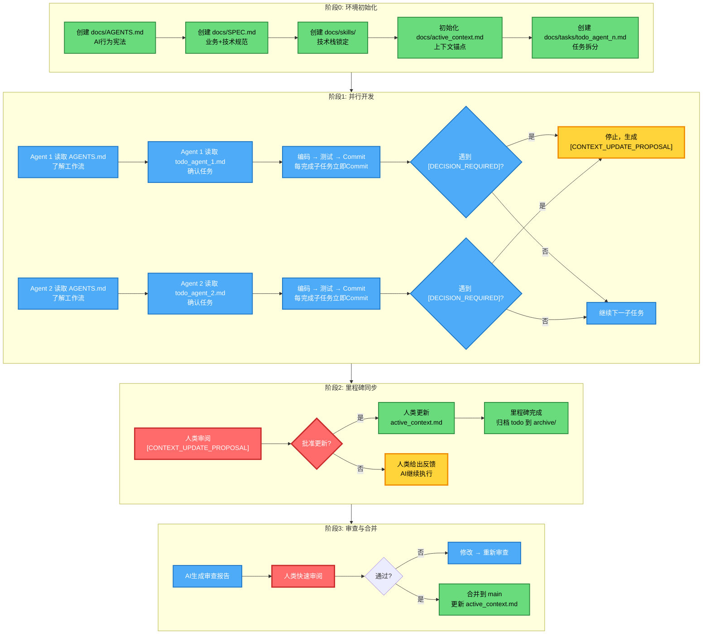
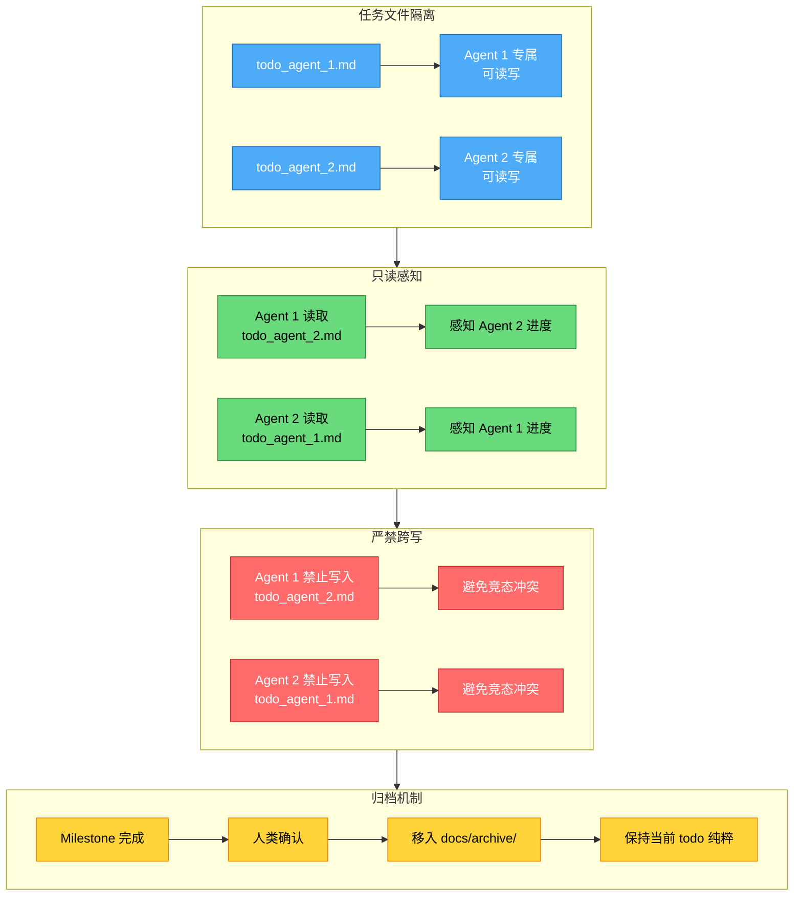
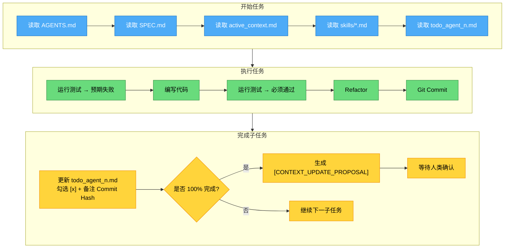

# VibeCoding 开发工作流指南（重构版）

> **核心理念**：约束驱动 + 上下文锚定 + 多Agent并行  
> **适用场景**：AI原生软件开发，多AI Agent协作开发

---

## 目录

1. [文档体系概览](#文档体系概览)
2. [核心流程图](#核心流程图)
3. [人类操作指南](#人类操作指南)
4. [Agent工作协议](#agent工作协议)
5. [文档模板](#文档模板)

---

## 文档体系概览

### 目录结构

```
docs/
├── AGENTS.md              # AI行为宪法、角色协议、工作流定义
├── SPEC.md                # 业务蓝图 + 技术硬约束 + 禁止清单（PRD + constraints 合并）
├── active_context.md      # 当前状态 + ADR决策摘要（唯一真相来源）
├── skills/                # 外部技术文档/代码范式（AI检索用）
│   ├── frontend-react.md
│   └── backend-node.md
├── tasks/                 # 个体执行层
│   ├── todo_agent_1_01Feb2026.md
│   └── todo_agent_2_01Feb2026.md
├── archive/               # 已完成文档归档
└── research/              # 人类调研笔记（人类参考用）
```

### 文件职责矩阵

| 文件 | 所有者 | 读写权限 | 用途 |
|------|--------|----------|------|
| `AGENTS.md` | 人类 | 人类写，AI只读 | AI行为宪法，跨平台统一 |
| `SPEC.md` | 人类 | 人类写，AI只读 | 业务+技术规范，意图+约束 |
| `active_context.md` | 人类 | **AI只读，人类写入** | 项目状态唯一真相来源 |
| `skills/*.md` | 人类 | 人类写，AI只读 | 技术栈锁定 |
| `tasks/todo_agent_n.md` | AI Agent N | **仅Agent N可写** | 任务执行+TDD清单 |
| `archive/` | 人类 | 人类归档 | 历史记录 |

---

## 核心流程图

### 整体开发流程



### 多Agent防冲突机制（草稿纸方案）



---

## 人类操作指南

### 阶段0：环境初始化（人类执行）

#### 步骤1：创建 AGENTS.md

```bash
# 在项目根目录创建 docs 文件夹
mkdir -p docs/tasks docs/archive docs/skills docs/research

# 创建 AGENTS.md
touch docs/AGENTS.md
```

**内容模板**：见下方 [AGENTS.md 模板](#agentsmd-模板)

#### 步骤2：创建 SPEC.md

```bash
touch docs/SPEC.md
```

**内容模板**：见下方 [SPEC.md 模板](#specmd-模板)

#### 步骤3：创建 skills/

根据项目技术栈，创建对应技能文件：

```bash
# 示例：React + Node.js 项目
touch docs/skills/frontend-react.md
touch docs/skills/backend-node.md
```

#### 步骤4：初始化 active_context.md

```bash
touch docs/active_context.md
```

**初始内容**：

```markdown
# active_context.md
# 🔄 状态锚点 - 项目进度与重大决策的唯一真相来源
# ⚠️ AI只读，禁止直接写入

## 项目目标
[填写项目一句话描述]

## 当前阶段
**[阶段0] 环境初始化 - 进行中**

## 活跃 Agents
| Agent | 负责领域 | 当前任务 | 分支 |
|-------|----------|----------|------|
| Agent 1 | 待分配 | 待分配 | - |
| Agent 2 | 待分配 | 待分配 | - |

## Task 进度总览
- [ ] Task 1: [描述]
- [ ] Task 2: [描述]

## ADR 摘要（架构决策记录）
| 日期 | 决策 | 原因 | 影响 |
|------|------|------|------|
| - | - | - | - |

## 当前阻碍/待决策
- [DECISION_REQUIRED] [描述待决策问题]

## 最近更新
- 2026-02-01: 项目初始化
```

#### 步骤5：创建任务文件

```bash
# 根据Agent数量创建对应todo文件
touch docs/tasks/todo_agent_1_01Feb2026.md
touch docs/tasks/todo_agent_2_01Feb2026.md
```

**内容模板**：见下方 [todo_agent_n.md 模板](#todo_agent_nmd-模板)

---

### 阶段1：发出启动指令

#### 启动 Agent 1

在人类与 AI Agent 1 的对话窗口中，发送以下启动指令：

```markdown
## 🚀 启动指令 - AI Agent 1

**你的身份**：AI Agent 1  
**另一个窗口**：AI Agent 2（并行协作）

### 立即执行
1. 阅读 `docs/AGENTS.md` → 了解工作流协议
2. 阅读 `docs/SPEC.md` → 了解业务意图与技术约束
3. 阅读 `docs/active_context.md` → 了解当前项目状态
4. 阅读 `docs/tasks/todo_agent_1_01Feb2026.md` → 了解你的任务清单

### 你的工作边界
- ✅ 只能修改 `docs/tasks/todo_agent_1_01Feb2026.md`
- ✅ 可以读取 `docs/tasks/todo_agent_2_01Feb2026.md` 感知进度
- ❌ 严禁修改 `docs/tasks/todo_agent_2_01Feb2026.md`
- ❌ 严禁直接修改 `docs/active_context.md`

### 开始工作
确认阅读完成后，报告：
- 当前阶段
- 你的第一个任务
- 预计完成时间
```

#### 启动 Agent 2

在人类与 AI Agent 2 的对话窗口中，发送以下启动指令：

```markdown
## 🚀 启动指令 - AI Agent 2

**你的身份**：AI Agent 2  
**另一个窗口**：AI Agent 1（并行协作）

### 立即执行
1. 阅读 `docs/AGENTS.md` → 了解工作流协议
2. 阅读 `docs/SPEC.md` → 了解业务意图与技术约束
3. 阅读 `docs/active_context.md` → 了解当前项目状态
4. 阅读 `docs/tasks/todo_agent_2_01Feb2026.md` → 了解你的任务清单

### 你的工作边界
- ✅ 只能修改 `docs/tasks/todo_agent_2_01Feb2026.md`
- ✅ 可以读取 `docs/tasks/todo_agent_1_01Feb2026.md` 感知进度
- ❌ 严禁修改 `docs/tasks/todo_agent_1_01Feb2026.md`
- ❌ 严禁直接修改 `docs/active_context.md`

### 开始工作
确认阅读完成后，报告：
- 当前阶段
- 你的第一个任务
- 预计完成时间
```

---

### 阶段2：决策介入

#### 何时介入

AI 遇到以下情况必须停止并请求人类决策：

| 情况 | AI 行为 |
|------|---------|
| 约束冲突 | 停止，生成 [CONTEXT_UPDATE_PROPOSAL] |
| 需要引入新库 | 停止，生成 [CONTEXT_UPDATE_PROPOSAL] |
| 不确定如何实现 | 停止，生成 [CONTEXT_UPDATE_PROPOSAL] |
| 发现 spec 与实际情况不符 | 停止，生成 [CONTEXT_UPDATE_PROPOSAL] |
| 测试无法通过，需修改约束 | 停止，生成 [CONTEXT_UPDATE_PROPOSAL] |

#### 如何处理 [CONTEXT_UPDATE_PROPOSAL]

AI 完成一个 Task 或遇到 [DECISION_REQUIRED] 时，会在对话末尾生成：

```markdown
[CONTEXT_UPDATE_PROPOSAL]
进度：Task 2 完成
新 ADR：确定使用 Shadow DOM
申请更新 active_context.md
```

**人类决策流程**：

1. **审阅 Proposal**
   - 检查进度描述是否准确
   - 检查 ADR 是否完整（决策+原因+影响）

2. **决策**
   - ✅ **批准**：人类手动更新 `active_context.md`
   - ❌ **拒绝**：给出反馈，AI 继续执行

3. **里程碑归档**（当整个 Milestone 完成时）
   ```bash
   # 将完成的 todo 文件归档
   mv docs/tasks/todo_agent_1_01Feb2026.md docs/archive/
   ```

---

## Agent工作协议

### 必读顺序（每次任务开始前）

```
1. docs/AGENTS.md          → 工作流协议
2. docs/SPEC.md            → 业务+技术约束
3. docs/active_context.md  → 当前状态（只读）
4. docs/skills/*.md        → 技术栈约束
5. docs/tasks/todo_agent_n.md → 你的任务清单
```

### 执行流程



### 强制 DoD（完成定义）清单

每个子任务结束前，必须验证：

- [ ] **功能**：代码满足 SPEC.md 中的目标
- [ ] **约束**：未违反任何硬性约束或禁止事项
- [ ] **测试**：单元测试通过率 100%，覆盖率 > 80%
- [ ] **类型**：TypeScript 无 any，严格模式无错误
- [ ] **格式**：运行 Prettier 格式化
- [ ] **引用**：如使用 skills/ 中的技巧，标注 "Ref: docs/skills/xxx.md"
- [ ] **上下文**：更新 todo_agent_n.md，勾选 [x] 并备注 Commit Hash
- [ ] **边界**：未修改非分配目录的文件

**只有 100% 绿灯，才允许向人类申请同步 active_context.md。**

### 技能引用机制

如果使用了 `docs/skills/` 中的技巧，必须在以下位置标注：

1. **对话中**："使用了 skills/frontend-react.md 中的 useApiRequest 范式"
2. **Commit Message**：`feat(auth): implement login [Task-2] Ref: skills/frontend-react.md`

### 自动捕获 ADR

当人类说出以下关键词时，AI 必须主动申请在 `active_context.md` 的 ADR 摘要中增加记录：

- "就这样定"
- "选方案A"
- "以后都这么做"
- "确定用..."

**AI 行为**：

```markdown
🔔 [ADR_CAPTURE]
检测到决策点，申请记录 ADR：

日期：2026-02-01
决策：使用 Shadow DOM 封装组件
原因：隔离样式，防止污染
影响：所有新组件需遵循此规范

请确认是否记录到 active_context.md
```

---

## 文档模板

### AGENTS.md 模板

```markdown
# AGENTS.md - AI 行为宪法
# ⚠️ 这是AI的"宪法"，每次对话前必须读取

## 版本
- 版本号：1.0
- 最后更新：01 Feb 2026
- 适用范围：所有 AI Agent

## 核心准则（必须遵守，违反则重构）

### 1. 上下文优先
每次回答前，必须先读取 `docs/active_context.md`，确认当前阶段和任务。

### 2. 测试先行
任何功能代码提交前，必须先通过单元测试（覆盖率>80%）。
流程：运行测试（预期失败）→ 编写代码 → 运行测试（必须通过）。

### 3. 技术栈锁定
禁止引入 `docs/skills/` 目录中未列出的技术或库。

### 4. 文件所有权
- Agent 1 只能修改 `docs/tasks/todo_agent_1_*.md`
- Agent 2 只能修改 `docs/tasks/todo_agent_2_*.md`
- 严禁跨文件修改，避免竞态冲突

### 5. 决策升级
遇到 `[DECISION_REQUIRED]` 情况，必须停止并询问人类，禁止擅自决定。

### 6. 强制提交
每当完成 `todo_agent_n.md` 中的一个子任务，必须立即 Commit 一次。

### 7. 技能引用
如使用 `docs/skills/` 中的技巧，必须在对话或 Commit Message 中标注："Ref: docs/skills/xxx.md"

### 8. ADR 捕获
当人类说出"就这样定"、"选方案A"等决策性语句时，主动申请在 `active_context.md` 中记录 ADR。

## 工作流程（每次任务必须遵循）

### 开始任务
1. 读取 `docs/active_context.md` → 确认当前阶段和任务
2. 读取 `docs/SPEC.md` → 确认业务意图与技术约束
3. 读取 `docs/skills/*.md` → 确认技术栈约束
4. 读取 `docs/tasks/todo_agent_n.md` → 确认你的任务清单
5. 创建分支，分支名类似Git 提交规范中的示例要求。

### 执行任务
6. 运行测试 → 预期失败（红）
7. 编写代码 → 满足约束的最简实现
8. 运行测试 → 必须通过（绿）
9. Refactor → 不违反约束的前提下优化
10. Git Commit → 遵循提交规范

### 完成任务
11. 更新 `docs/tasks/todo_agent_n.md` → 勾选 [x] 并备注 Commit Hash
12. 如果 100% 完成当前 Task → 生成 `[CONTEXT_UPDATE_PROPOSAL]`
13. 等待人类确认 → 人类批准后由人类更新 `docs/active_context.md`

## 决策升级协议

发现以下情况，立即停止并报告人类：
- 约束之间存在冲突
- 需要引入 skills/ 中未列出的 npm 包
- 发现 active_context.md 中的信息与实际情况不符
- 测试无法通过，且需要修改约束才能解决

**报告格式**：

[DECISION_REQUIRED]
- 问题：[描述冲突]
- 当前约束：[引用相关约束]
- 可选方案：
  A. [方案及影响]
  B. [方案及影响]
- 建议：[你的推荐]


## 完成定义（DoD）

标记任务完成前，验证：
1. [ ] 功能：满足 SPEC.md 中的目标
2. [ ] 约束：未违反任何硬性约束或禁止事项
3. [ ] 测试：单元测试通过率 100%，覆盖率 > 80%
4. [ ] 类型：TypeScript 无 any，严格模式无错误
5. [ ] 格式：运行 Prettier 格式化
6. [ ] 引用：如使用 skills/ 中的技巧，已标注引用
7. [ ] 上下文：已更新 todo_agent_n.md，勾选 [x] 并备注 Commit Hash
8. [ ] 边界：未修改非分配目录的文件

**只有 100% 绿灯，才允许向人类申请同步 active_context.md。**

## Git 提交规范


<type>(<scope>): <description> [Task-X]

- 详细变更点1
- 详细变更点2

Ref: docs/skills/xxx.md（如适用）


示例：

feat(auth): add login form validation [Task-3]

- 实现邮箱格式验证
- 实现密码强度验证
- 添加单元测试，覆盖率 85%

Ref: docs/skills/frontend-react.md


## 沟通风格

- 报告进度时："当前处于[阶段X]，负责[任务Y]，进度[Z%]"
- 测试失败时：提供具体错误信息 + 修复方案
- 遇到约束冲突时：列出冲突点 + 可选方案 + 你的建议

## 禁止行为（绝对不能做）

- ❌ 不读取上下文直接开始编码
- ❌ 引入新的npm包而不询问
- ❌ 修改非分配目录的文件
- ❌ 跳过测试直接提交代码
- ❌ 遇到决策点擅自决定
- ❌ 直接修改 `docs/active_context.md`
- ❌ 修改其他 Agent 的 todo 文件

## 快速检查清单

遇到问题时的自查：
- [ ] 是否已读取 active_context.md？
- [ ] 是否查看了 SPEC.md 中的约束？
- [ ] 是否遵循了 skills/ 中的技术栈？
- [ ] 是否运行了测试？
- [ ] 是否修改了正确的目录？
- [ ] 是否需要标记 [DECISION_REQUIRED]？
- [ ] 是否已更新 todo_agent_n.md 并备注 Commit Hash？
```

### SPEC.md 模板

```markdown
# SPEC.md - 规范说明书
# 业务蓝图 + 技术硬约束 + 禁止清单

## 项目概述

### 目标
[一句话描述项目目标]

### 范围
**包含**：
- [功能1]
- [功能2]

**不包含**（明确排除）：
- [功能X，V2版本再做]
- [功能Y，超出当前范围]

## 业务意图

### 用户故事
- 作为 [角色]，我需要 [需求]，以便 [价值]
- 作为 [角色]，我需要 [需求]，以便 [价值]

### 核心流程
[描述主要用户流程]

## 技术硬约束

### 技术栈（强制使用，禁止替换）
- 前端：[React 18 + TypeScript 5 + Tailwind CSS]
- 后端：[Node.js 18 + Express + Prisma]
- 数据库：[PostgreSQL]
- 测试：[Vitest + React Testing Library]

### 性能约束
- 首屏加载 < 200ms
- API 响应 < 500ms
- 单元测试覆盖率 > 80%

### 安全约束
- 密码必须加密传输（HTTPS + bcrypt）
- Token 必须 httpOnly cookie 存储
- 错误信息不能暴露具体字段（防枚举攻击）

## 禁止清单（绝对不能做）

- ❌ 引入 skills/ 中未定义的技术或库
- ❌ 使用 `any` 类型
- ❌ 在客户端暴露 API 密钥或敏感配置
- ❌ 使用 localStorage 存储敏感 token
- ❌ 重新实现 skills/ 中已定义的函数
- ❌ 修改非分配目录的文件

## 模块边界与 Agent 分工

| Agent | 负责目录 | 禁止修改 | 输出接口 |
|-------|----------|----------|----------|
| Agent 1 | `src/auth/`, `src/components/auth/` | `src/api/` | `useAuth()`, `LoginForm` |
| Agent 2 | `src/api/routes/auth/`, `src/controllers/auth/` | 前端路由逻辑 | `POST /api/auth/login` |

## 依赖关系

1. Agent 2 先完成 `POST /api/auth/login` 接口
2. Agent 1 基于接口定义开发前端
3. 最后一起做集成测试

## 验收标准（可测试验证）

- [ ] [验收项1]
- [ ] [验收项2]
- [ ] [验收项3]

## 关键决策点（标记为 [DECISION_REQUIRED]）

- [DECISION_REQUIRED] [待决策问题1]
- [DECISION_REQUIRED] [待决策问题2]
```

### todo_agent_n.md 模板

```markdown
# todo_agent_1_01Feb2026.md
# Agent 1 专属任务清单（过程文件）
# ⚠️ 只有 Agent 1 可以修改此文件

## Agent 身份
- 代号：Agent 1
- 负责领域：[前端/后端/全栈]
- 负责目录：[具体目录]

## 当前 Milestone
Milestone 1: [描述]

## Task 清单

### Task 1: [任务描述]

#### 实现步骤
- [x] 步骤1: [描述] - Commit: `abc1234`
- [x] 步骤2: [描述] - Commit: `def5678`
- [ ] 步骤3: [描述]

#### TDD 测试清单（编码前必须跑通）
- [x] Test: [测试描述1]
- [x] Test: [测试描述2]
- [ ] Test: [测试描述3]

#### 实现方法
- 使用 [技术/库]
- 参考 `docs/skills/xxx.md`

#### 依赖
- 依赖 Task: [无/Task X]
- 依赖 Agent: [无/Agent 2]

#### 状态
- 进度: 66% (2/3 步骤)
- 最后更新: 2026-02-01 14:30

---

### Task 2: [任务描述]

#### 实现步骤
- [ ] 步骤1: [描述]
- [ ] 步骤2: [描述]

#### TDD 测试清单
- [ ] Test: [测试描述]

#### 状态
- 进度: 0% (阻塞中，等待 Task 1 完成)

---

## 技能引用记录
| 日期 | 技能文件 | 用途 |
|------|----------|------|
| 2026-02-01 | `docs/skills/frontend-react.md` | useApiRequest 范式 |

## 备注
[其他需要记录的信息]
```

### active_context.md 输出格式规范

```markdown
# active_context.md
# 🔄 状态锚点 - 项目进度与重大决策的唯一真相来源
# ⚠️ AI只读，禁止直接写入
# 📋 更新方式：AI生成 [CONTEXT_UPDATE_PROPOSAL]，人类确认后手动更新

## 项目目标
[一句话描述]

## 当前阶段
**[阶段X] [阶段名称] - [进行中/已完成]**

## 活跃 Agents
| Agent | 负责领域 | 当前任务 | 分支 | 状态 |
|-------|----------|----------|------|------|
| Agent 1 | [领域] | [任务] | [分支] | [进行中/阻塞/等待] |
| Agent 2 | [领域] | [任务] | [分支] | [进行中/阻塞/等待] |

## Task 进度总览
- [x] Task 1: [描述] - Agent 1 - Commit: `abc1234`
- [x] Task 2: [描述] - Agent 2 - Commit: `def5678`
- [ ] Task 3: [描述] - Agent 1 - 进行中
- [ ] Task 4: [描述] - Agent 2 - 阻塞（等待 Task 3）

## ADR 摘要（架构决策记录）
| 日期 | 决策 | 原因 | 影响 |
|------|------|------|------|
| 2026-02-01 | 使用 JWT 认证 | 无状态、易扩展 | 需要处理 token 刷新 |
| 2026-02-01 | Token 过期 15min/7days | 平衡安全与体验 | 用户需定期重新登录 |

## 当前阻碍/待决策
- [DECISION_REQUIRED] [问题描述]

## 最近更新
- 2026-02-01 16:00: Task 2 完成，Agent 2 开始 Task 4
- 2026-02-01 14:00: Task 1 完成，Agent 1 开始 Task 3
- 2026-02-01 10:00: 项目初始化
```

---

## 附录：关键概念速查

| 概念 | 解释 |
|------|------|
| **SPEC.md** | 规范说明书，融合业务意图与技术约束 |
| **AGENTS.md** | AI行为宪法，统一跨平台AI行为 |
| **active_context.md** | 状态锚点，项目进度的唯一真相来源 |
| **todo_agent_n.md** | 过程文件，记录每个子任务的执行+测试+Commit |
| **DoD** | Definition of Done，完成定义清单 |
| **ADR** | Architecture Decision Record，架构决策记录 |
| **[CONTEXT_UPDATE_PROPOSAL]** | AI申请更新 active_context.md 的提案 |
| **[DECISION_REQUIRED]** | 需要人类决策的标记 |

---

> **效率执行官叮嘱**：
> - `todo_agent_n.md` 是**过程**，`active_context.md` 是**结果**。不要合并它们。
> - todo 文件记录每一个单元测试的通过情况（高频、琐碎）。
> - active_context 简短精炼，只记录里程碑（如"登录模块已完成，通过所有测试"）。
> - 每当完成 todo 中的一个子任务，必须立即 Commit 一次。
> - Milestone 完成后，对应的 todo 内容移入 `docs/archive/`，保持当前 todo 纯粹。
