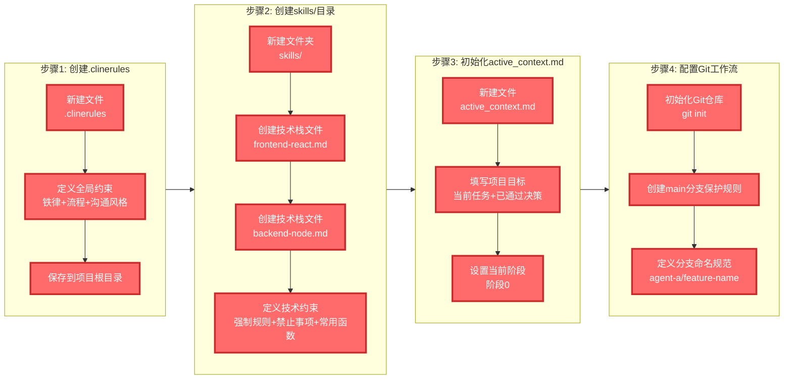
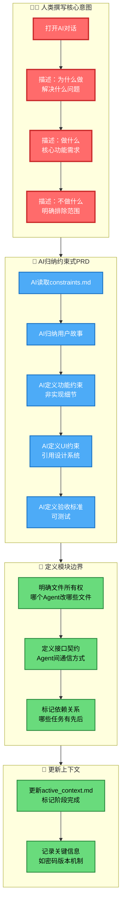
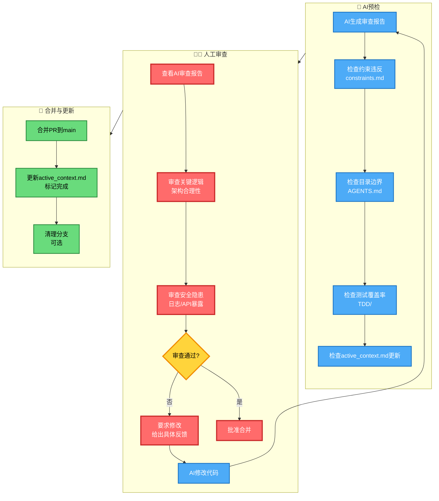
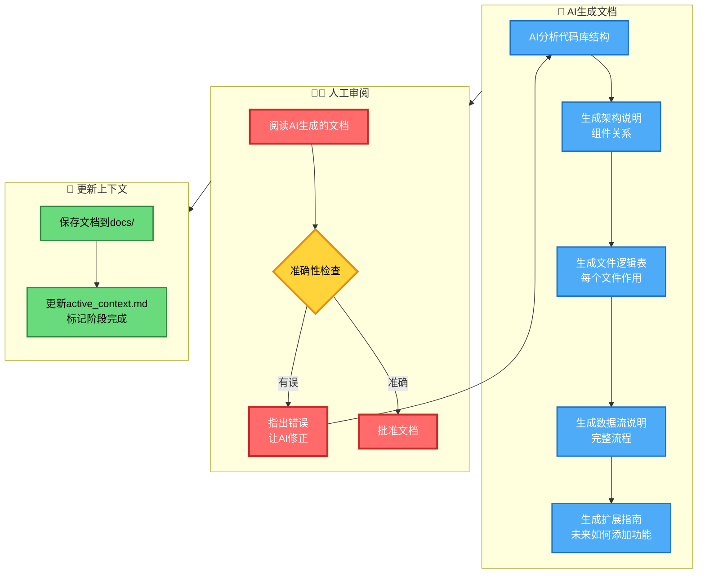
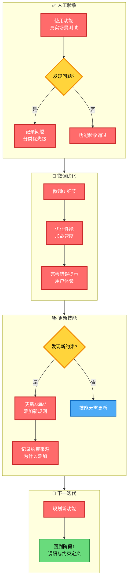

# VibeCoding 完整开发工作流指南

> **适用人群**：0基础入门开发者  
> **核心理念**：让AI做它擅长的（代码实现），让人类做人类擅长的（意图定义与决策）  
> **流程特点**：约束驱动 + 上下文锚定 + 多Agent并行

---

## 📚 目录

1. [核心概念速览](#核心概念速览)
2. [整体开发流程大图](#整体开发流程大图)
3. [阶段详解与分步操作](#阶段详解与分步操作)
   - 阶段0：环境初始化
   - 阶段1：调研与约束定义
   - 阶段2：约束式PRD
   - 阶段3：规划与分配
   - 阶段4：并行开发
   - 阶段5：审查与合并
   - 阶段6：架构文档生成
   - 阶段7：迭代维护
4. [工具价值详解](#工具价值详解)
5. [人类介入时刻总览](#人类介入时刻总览)
6. [完整实例：开发一个任务管理应用](#完整实例开发一个任务管理应用)

---

## 核心概念速览

在开始之前，先理解几个核心概念：

| 概念 | 通俗解释 | 作用 |
|------|---------|------|
| **约束式规范** | 告诉AI"必须做什么"和"绝对不能做什么"，而不是"具体怎么做" | 给AI保留创新空间，同时划定边界 |
| **上下文锚点** | 一个文件记录当前项目状态和进度 | 换AI模型/窗口后能快速恢复状态 |
| **技术栈锁定** | 用文件规定必须用哪些技术 | 防止AI随机引入新库 |
| **文件所有权** | 每个AI Agent只能修改特定目录 | 多AI并行不冲突 |
| **TDD（测试驱动开发）** | 先写测试，再写代码 | 确保代码质量，减少bug |

---

## 整体开发流程大图

```mermaid
flowchart TB
    subgraph Setup["🚀 阶段0: 环境初始化<br/>一次性设置，持续维护"]
        direction TB
        S1["创建.clinerules<br/>全局AI行为约束"] --> S2["创建skills/目录<br/>技术栈锁定"]
        S2 --> S3["初始化active_context.md<br/>上下文锚点"]
        S3 --> S4["配置Git工作流<br/>分支策略"]
    end
    
    subgraph Research["🔍 阶段1: 调研与约束定义<br/>人工主导，AI辅助"]
        direction TB
        R1["人工调研<br/>搜索资料/库/最佳实践"] --> R2["定义约束式规范constraints.md<br/>目标+禁止+边界"]
        R2 --> R3["AI提出2-3个方案<br/>人工选择最佳"]
        R3 --> R4["创建ADR目录<br/>记录架构决策"]
        R4 --> R5["生成AGENTS.md<br/>跨平台规范"]
        R5 --> R6["更新active_context.md<br/>标记阶段完成"]
    end
    
    subgraph PRD["📝 阶段2: 约束式PRD<br/>人工意图+AI归纳"]
        direction TB
        P1["人工撰写核心意图<br/>为什么/做什么/不做什么"] --> P2["AI归纳约束式PRD<br/>非详细文档"]
        P2 --> P3["定义模块边界<br/>文件所有权分配"]
        P3 --> P4["更新active_context.md<br/>标记阶段完成"]
    end
    
    subgraph Planning["📋 阶段3: 规划与分配<br/>Plan Mode + 分支隔离"]
        direction TB
        PL1["启用Plan Mode<br/>生成Task Artifacts"] --> PL2["拆解Task清单<br/>分配Agent"]
        PL2 --> PL3["创建隔离工作树<br/>每个Agent独立分支"]
        PL3 --> PL4["生成TDD文档<br/>测试先行"]
        PL4 --> PL5["更新active_context.md<br/>标记阶段完成"]
    end
    
    subgraph Dev["💻 阶段4: 并行开发<br/>TDD + 上下文维护"]
        direction TB
        D1["Agent读取active_context.md<br/>确认阶段和任务"] --> D2["编码前运行测试<br/>预期失败"]
        D2 --> D3{"测试通过?"}
        D3 -->|否| D4["按约束优化代码<br/>AI自主决策"]
        D4 --> D5{"遇到重大决策?"}
        D5 -->|是| D6["停止并询问人类<br/>等待决策"]
        D5 -->|否| D2
        D3 -->|是| D7["提交代码<br/>更新上下文"]
        D7 --> D8{"还有更多Task?"}
        D8 -->|是| D1
        D8 -->|否| D9["创建PR<br/>等待审查"]
    end
    
    subgraph Review["✅ 阶段5: 审查与合并<br/>人工把关，AI辅助"]
        direction TB
        RV1["AI生成审查报告<br/>检查约束/测试/边界"] --> RV2["人工快速审阅<br/>关键逻辑+安全"]
        RV2 --> RV3{"审查通过?"}
        RV3 -->|否| RV4["返回修改<br/>更新代码"]
        RV4 --> RV1
        RV3 -->|是| RV5["合并到主分支<br/>更新active_context.md"]
    end
    
    subgraph Doc["📖 阶段6: 架构文档生成<br/>AI反向解释代码"]
        direction TB
        DOC1["AI生成架构说明<br/>文件逻辑+数据流"] --> DOC2["生成开发文档<br/>项目信息+扩展指南"]
        DOC2 --> DOC3["更新active_context.md<br/>标记阶段完成"]
    end
    
    subgraph Iter["🔄 阶段7: 迭代维护<br/>持续优化循环"]
        direction TB
        I1["人工验收功能<br/>微调细节"] --> I2["发现新约束/问题<br/>更新skills/"]
        I2 --> I3["版本迭代规划<br/>回到阶段1"]
    end
    
    Setup --> Research --> PRD --> Planning --> Dev --> Review --> Doc --> Iter
    
    %% 样式定义
    classDef humanFocus fill:#ff6b6b,stroke:#c92a2a,stroke-width:3px,color:#fff
    classDef aiWork fill:#4dabf7,stroke:#1971c2,stroke-width:2px,color:#fff
    classDef fileArtifact fill:#69db7c,stroke:#2b8a3e,stroke-width:2px,color:#000
    classDef decision fill:#ffd43b,stroke:#f08c00,stroke-width:3px,color:#000
    
    %% 应用样式
    class R1,R2,R3,P1,RV2 humanFocus
    class S1,S2,S3,S4,R5,R6,P4,PL3,PL5,D7,RV5,DOC3 fileArtifact
    class D3,D5,RV3 decision
    class R4,P2,P3,PL1,PL2,PL4,D1,D2,D4,D6,D8,D9,RV1,RV4,DOC1,DOC2,I1,I2,I3 aiWork
    
    %% 特殊标记人工节点
    style R1 fill:#ff6b6b,stroke:#c92a2a,stroke-width:4px,color:#fff
    style R2 fill:#ff6b6b,stroke:#c92a2a,stroke-width:4px,color:#fff
    style R3 fill:#ff6b6b,stroke:#c92a2a,stroke-width:4px,color:#fff
    style P1 fill:#ff6b6b,stroke:#c92a2a,stroke-width:4px,color:#fff
    style D6 fill:#ff6b6b,stroke:#c92a2a,stroke-width:4px,color:#fff
    style RV2 fill:#ff6b6b,stroke:#c92a2a,stroke-width:4px,color:#fff
```



### 流程图阅读指南

- **🔴 红色节点**：人类必须介入的关键时刻
- **🟢 绿色节点**：生成的文件/配置（需要人工创建或维护）
- **🔵 蓝色节点**：AI执行的工作
- **🟡 黄色菱形**：决策点

---

## 阶段详解与分步操作

### 🚀 阶段0：环境初始化

> **目标**：建立"规则即代码"的基础设施，防止AI随机性  
> **耗时**：首次约30分钟，后续持续维护  
> **人类介入度**：⭐⭐⭐⭐⭐（100%人工完成）

#### 阶段0流程图



#### 分步操作详解

**步骤1：创建 `.clinerules` 文件**

```markdown
# .clinerules - 放置于项目根目录
# ⚠️ 这是AI的"宪法"，每次对话前AI必须读取

## 铁律（必须遵守，违反则重构）
1. **上下文优先**：每次回答前，必须先读取 `active_context.md`，确认当前阶段和任务
2. **测试先行**：任何功能代码提交前，必须先通过单元测试（覆盖率>80%）
3. **技术栈锁定**：禁止引入 `skills/` 目录中未列出的技术或库
4. **模块化隔离**：只能修改自己被分配的目录，禁止跨目录修改
5. **决策点停止**：遇到标记为 [DECISION_REQUIRED] 的情况，必须停止并询问用户

## 工作流程（每次任务必须遵循）
1. 【开始】读取 active_context.md → 确认当前阶段和任务
2. 【执行】读取相关 skills/ 文件 → 确认技术约束
3. 【编码】如果存在 TDD 文档，先运行测试（预期失败）→ 编写代码 → 运行测试（必须通过）
4. 【完成】更新 active_context.md → 标记任务完成 → 提交代码

## 沟通风格
- 报告进度时，先说明："当前处于[阶段X]，负责[任务Y]"
- 测试失败时，提供：具体错误信息 + 修复方案，不要直接问"怎么办"
- 遇到约束冲突时，列出：冲突点 + 可选方案 + 你的建议，等待决策

## 禁止行为（绝对不能做）
- ❌ 不读取上下文直接开始编码
- ❌ 引入新的npm包而不询问
- ❌ 修改非分配目录的文件
- ❌ 跳过测试直接提交代码
- ❌ 遇到决策点擅自决定
```

**步骤2：创建 `skills/` 技术栈锁定目录（前端和后端两份示例，你可以根据项目给出更多的skills文件）**

```markdown
# skills/frontend-react.md
---
description: React + TypeScript 前端开发规范
scope: 所有前端代码生成
version: 1.0
---

## 技术栈（强制使用，禁止替换）
- React 18 + TypeScript 5（strict mode 必须开启）
- Tailwind CSS 3.x（设计系统已定义）
- React Query（数据获取，禁止用SWR替代）
- Zustand（状态管理，禁止用Redux/Vuex替代）
- Vitest + React Testing Library（测试框架）
- React Hook Form + Zod（表单处理，禁止Formik）
- React Router v6（路由管理）

## 文件结构约束（必须遵守）
src/
├─ components/                     # UI 组件
│  ├─ ui/                          # 基础组件（Button、Input 等）
│  ├─ forms/                       # 表单相关组件
│  ├─ *.tsx                        # 组件实现文件
│  └─ *.test.tsx                   # 每个组件必须有同目录测试
│
├─ hooks/                          # 自定义 Hooks
│  ├─ *.ts
│  └─ *.test.ts                    # Hooks 必须配套测试
│
├─ lib/                            # 工具与基础能力
│  ├─ api.ts                       # useApiRequest() 必须复用，禁止重复实现 fetch
│  ├─ utils.ts                     # formatDate()、formatCurrency() 等通用工具
│  └─ constants.ts                 # 全局常量定义
│
├─ store/                          # Zustand 状态管理
│  └─ *.ts
│
└─ types/                          # TypeScript 类型定义
   └─ *.ts

## 强制规则（代码必须满足）
1. 所有组件必须是函数组件，使用TypeScript
2. 禁止使用 `any` 类型，必须用严格类型
3. 每个组件必须有对应的 `*.test.tsx` 测试文件
4. 异步状态命名规范：`isLoading`（查询）, `isSubmitting`（提交）
5. 加载组件统一使用 `<Skeleton />` 或 `<Spinner />`

## 禁止事项（绝对不能做）
- ❌ 使用 `any` 类型
- ❌ 引入新的表单库（Formik, Final Form等）
- ❌ 在客户端暴露 API 密钥或敏感配置
- ❌ 使用 localStorage 存储敏感token（必须用httpOnly cookie）
- ❌ 直接修改 node_modules
- ❌ 重新实现 skills/ 中已定义的函数

## 常用函数（强制复用，禁止重新实现）
- `useApiRequest()` - lib/api.ts，用于所有API请求
- `formatDate(date: Date, format?: string)` - lib/utils.ts，日期格式化
- `formatCurrency(amount: number, currency?: string)` - lib/utils.ts，货币格式化
- `cn(...classes: (string | undefined)[])` - lib/utils.ts，Tailwind类名合并

## 测试要求
- 每个组件必须有单元测试（覆盖率>80%）
- 测试命令：`npm run test:unit`
- 必须测试：正常情况、边界情况、错误情况
```

```markdown
# skills/backend-node.md
---
description: Node.js + Express 后端开发规范
scope: 所有后端代码生成
version: 1.0
---

## 技术栈（强制使用）
- Node.js 18+ + Express 4.x
- TypeScript 5（strict mode）
- Prisma（ORM，禁止用TypeORM替代）
- PostgreSQL（数据库）
- bcrypt（密码加密，cost factor 12）
- JWT（token管理）
- Jest（测试框架）

## 文件结构约束（必须遵守）
src
├─ routes/                         # API 路由
│  ├─ *.ts
│  └─ *.test.ts                    # 路由必须有同目录测试
│
├─ controllers/                    # 业务逻辑层
│  └─ *.ts
│
├─ models/                         # 数据模型（Prisma）
│  └─ schema.prisma
│
├─ middleware/                     # 中间件
│  ├─ auth.ts                      # 认证中间件（必须复用）
│  └─ errorHandler.ts              # 错误处理中间件（必须复用）
│
├─ utils/                          # 工具函数
│  └─ *.ts
│
└─ types/                          # TypeScript 类型定义
   └─ *.ts

## 强制规则
1. 所有API必须返回统一格式：`{success: boolean, data?: any, error?: string}`
2. 错误信息不能暴露内部细节（如"用户不存在" vs "密码错误"要统一）
3. 所有路由必须有对应的 `*.test.ts` 测试文件
4. 密码必须用 bcrypt 加密（cost factor 12）
5. JWT必须包含版本字段，支持token失效

## 禁止事项
- ❌ 在错误响应中暴露堆栈信息
- ❌ 明文存储密码
- ❌ 在日志中记录敏感信息
- ❌ 重新实现 middleware/ 中已定义的中间件

## 常用函数（强制复用）
- `authMiddleware()` - middleware/auth.ts，用于路由保护
- `errorHandler()` - middleware/errorHandler.ts，统一错误处理
- `generateToken(payload: object)` - utils/jwt.ts，生成JWT
- `verifyToken(token: string)` - utils/jwt.ts，验证JWT
```

**步骤3：初始化 `active_context.md` 上下文锚点**

```markdown
# active_context.md
# 🔄 更新时间：2026-02-01 10:00
# 👤 最后更新者：人类

## 项目目标
开发一个任务管理应用（Task Manager），支持多用户协作、任务分配、进度追踪。

## 当前阶段
**[阶段0] 环境初始化 - 进行中**

## 当前进行中的任务
- [x] 创建 .clinerules 文件
- [x] 创建 skills/ 目录和技能文件
- [x] 初始化 active_context.md
- [ ] 配置Git工作流
- [ ] 阶段0完成，进入阶段1

## 已通过的关键决策（ADR）
- 技术栈：React + Node.js（已锁定）
- 状态管理：Zustand（禁止Redux）
- 数据库：PostgreSQL（已确定）

## 当前阻碍/待决策
- 未定：认证方案选JWT还是Session？
- 未定：是否支持第三方登录（Google/GitHub）？

## Agent分工与文件所有权（阶段3后填充）
| Agent | 负责目录 | 当前任务 |
|-------|---------|---------|
| Agent-A (Cline) | `src/components/`, `src/hooks/` | 待分配 |
| Agent-B (Trae) | `src/api/routes/`, `src/controllers/` | 待分配 |

## 活跃分支
- main: 主分支（保护，不允许在未经人类确认的情况下向该分支提交内容）
```

**步骤4：配置Git工作流**

```bash
# 在项目根目录执行

# 1. 初始化Git仓库
git init

# 2. 创建main分支（如果不存在）
git checkout -b main

# 3. 添加初始文件
git add .
git commit -m "chore: 初始化项目，添加AI开发规范"

# 4. 设置分支保护规则（在GitHub/GitLab上设置）
# - 禁止直接push到main
# - 必须通过PR合并
# - 必须通过测试才能合并
```

#### 本阶段工具价值

| 工具 | 价值 | 为什么重要 |
|------|------|-----------|
| `.clinerules` | 统一AI行为 | 防止不同AI给出不同风格的代码 |
| `skills/` | 锁定技术栈 | 避免AI随机引入新库，减少"幻觉函数" |
| `active_context.md` | 状态同步 | 换AI模型/窗口后能快速恢复状态 |
| Git分支 | 隔离并行 | 多AI同时工作不冲突 |

---

### 🔍 阶段1：调研与约束定义

> **目标**：避免AI因知识陈旧给出次优方案，用**约束**而非**细节**指导AI  
> **耗时**：30-60分钟  
> **人类介入度**：⭐⭐⭐⭐⭐（人类主导，AI辅助）

#### 阶段1流程图

```mermaid
flowchart TB
    subgraph Step1["步骤1：人工调研"]
        direction TB
        S1A[搜索最新资料<br/>Google/知乎/GitHub] --> S1B[查看趋势库<br/>GitHub Trending]
        S1B --> S1C[阅读官方文档<br/>确认最佳实践]
        S1C --> S1D[整理调研笔记<br/>记录关键发现]
    end
    
    subgraph Step2["步骤2：定义约束式规范"]
        direction TB
        S2A[创建constraints.md] --> S2B[填写目标<br/>要做什么]
        S2B --> S2C[填写硬性约束<br/>必须满足的条件]
        S2C --> S2D[填写禁止事项<br/>绝对不能做]
        S2D --> S2E[填写模块边界<br/>Agent分工]
        S2E --> S2F["标记决策点<br/>[DECISION_REQUIRED]"]
    end
    
    subgraph Step3["步骤3：AI辅助方案（AI辅助）"]
        direction TB
        S3A[人类提供约束] --> S3B[AI提出2-3个方案]
        S3B --> S3C[列出优缺点<br/>风险分析]
        S3C --> S3D[人类选择最佳方案]
    end
    
    subgraph Step4["步骤4：记录架构决策"]
        direction TB
        S4A[创建docs/adr/目录] --> S4B[ADR-001: 技术方案选择]
        S4B --> S4C[ADR-002: Token策略等]
        S4C --> S4D[轻量级格式<br/>状态+决策+后果]
    end
    
    subgraph Step5["步骤5：生成AI操作手册"]
        direction TB
        S5A[创建AGENTS.md<br/>AI操作指南] --> S5B[定义Read-Write-Verify协议]
        S5B --> S5C[定义Agent分工<br/>目录所有权]
        S5C --> S5D["定义决策升级协议<br/>[DECISION_REQUIRED]"]
        S5D --> S5E[定义DoD完成标准]
        S5E --> S5F[引用skills/<br/>不重复技术约束]
    end
    
    subgraph Step6["步骤6：更新上下文"]
        direction TB
        S6A[更新active_context.md] --> S6B[标记阶段1完成]
        S6B --> S6C[记录ADR引用<br/>不重复内容]
        S6C --> S6D[标记待决策项状态]
    end
    
    Step1 --> Step2 --> Step3 --> Step4 --> Step5 --> Step6
    
    classDef humanMust fill:#ff6b6b,stroke:#c92a2a,stroke-width:4px,color:#fff
    classDef aiAssist fill:#4dabf7,stroke:#1971c2,stroke-width:2px,color:#fff
    classDef outputFile fill:#69db7c,stroke:#2b8a3e,stroke-width:3px,color:#000
    
    class S1A,S1B,S1C,S1D,S2A,S2B,S2C,S2D,S2E,S2F,S3D,S4A,S4B,S4C,S4D,S5A,S5B,S5C,S5D,S5E,S5F,S6A,S6B,S6C,S6D humanMust
    class S3A,S3B,S3C aiAssist
    class S4B,S4C,S5A,S6A outputFile
```



#### 分步操作详解

**步骤1：人工调研（30分钟）**

打开浏览器，进行以下搜索：

```
搜索关键词示例：
1. "React 2025 最佳认证方案 JWT vs Session"
2. "Zustand 状态管理最佳实践 2024"
3. "React Query vs SWR 性能对比"
4. "Node.js 2025 后端架构趋势"
5. "bcrypt vs argon2 密码加密对比"

查看资源：
- GitHub Trending: https://github.com/trending
- React官方文档: https://react.dev/
- Node.js最佳实践: https://github.com/goldbergyoni/nodebestpractices
```

记录调研结果：

```markdown
# research/调研笔记.md

## 日期：2026-02-01

### 认证方案调研
| 方案 | 优点 | 缺点 | 适用场景 |
|------|------|------|---------|
| JWT | 无状态、易扩展 | Token刷新复杂 | 分布式系统 |
| Session | 简单、安全 | 需要存储、难扩展 | 单体应用 |

**结论**：选择JWT，因为项目可能需要水平扩展

### 状态管理调研
| 方案 | 学习曲线 | 性能 | 生态 |
|------|---------|------|------|
| Zustand | 低 | 高 |  growing |
| Redux | 高 | 中 | 成熟 |

**结论**：选择Zustand，团队熟悉且足够轻量
```

**步骤2：定义约束式规范**

创建 `constraints.md`：

```markdown
# constraints.md - 约束式规范
# 🎯 目标：开发任务管理应用的核心功能

## 目标：实现用户认证系统
让用户能够安全地注册、登录、管理自己的任务

## 硬性约束（必须满足，不可妥协）
- **技术栈**：React Hook Form + Zod（已在skills/中定义）
- **性能**：首屏加载 < 200ms（Lighthouse评分>90）
- **安全**：
  - 密码必须加密传输（HTTPS + bcrypt）
  - 错误信息不能暴露具体字段（防枚举攻击）
  - Token必须httpOnly cookie存储
- **UI**：遵循现有设计系统，使用Tailwind表单组件类
- **测试**：单元测试覆盖率>80%，集成测试覆盖核心流程

## 禁止事项（绝对不能做）
- ❌ 引入新的表单库（Formik, Final Form等）
- ❌ 在客户端暴露API密钥或敏感配置
- ❌ 使用localStorage存储敏感token
- ❌ 错误响应区分"用户不存在"和"密码错误"
- ❌ 明文传输密码

## 模块边界（Agent分工）
| Agent | 目录所有权 | 禁止修改 |
|-------|-----------|---------|
| Agent-A (Cline) | `src/auth/`, `src/components/auth/` | backend/目录 |
| Agent-B (Trae) | `src/api/routes/auth/`, `src/controllers/auth/` | 前端路由逻辑 |

## 关键决策点（标记为[DECISION_REQUIRED]）
- [DECISION_REQUIRED] 选JWT还是Session？（影响后续所有实现）
- [DECISION_REQUIRED] 是否支持社交登录？（影响数据库schema）
- [DECISION_REQUIRED] Token过期时间设置？（影响用户体验和安全性）
```

**步骤3：让AI提出方案**

打开Gemini 3 Pro或DeepSeek-reasoner，输入：

```markdown
基于以下约束，请提出2-3个不同的实现方案，列出优缺点：

[粘贴 constraints.md 内容]

要求：
1. 每个方案必须明确说明如何满足<200ms首屏加载
2. 指出每个方案可能违反的"禁止事项"风险
3. 推荐一个最佳方案并说明理由
4. 针对每个[DECISION_REQUIRED]给出建议
```

AI可能返回：

```markdown
## 方案对比

### 方案A：JWT（Access + Refresh Token）
- 优点：无状态、易水平扩展
- 缺点：需要处理token刷新逻辑
- 首屏优化：使用React Query缓存，减少请求
- 风险：需确保refresh token安全存储

### 方案B：Session + Redis
- 优点：简单、安全
- 缺点：需要Redis依赖，扩展复杂
- 首屏优化：Session ID很小，传输快
- 风险：可能违反"禁止引入新依赖"（Redis）

## 推荐：方案A（JWT）
理由：符合项目可能扩展的需求，且无需引入Redis

## 决策建议
1. **JWT vs Session**：推荐JWT，理由如上
2. **社交登录**：建议V2版本再做，先保证核心功能
3. **Token过期**：Access 15分钟，Refresh 7天
```

**步骤4：创建ADR目录，以便记录未来架构决策(两个示例)**
```markdown
# 创建独立的ADR目录，不要写在AGENTS.md里：
mkdir -p docs/adr
```

```markdown
# docs/adr/ADR-001-authentication.md

## 状态
已接受 (2026-02-01)

## 背景
需要选择用户认证方案，约束见 ../../constraints.md

## 决策
使用 JWT (Access + Refresh Token)

## 原因
- 满足无状态需求，易于水平扩展
- 不引入 Redis 依赖（避免违反技术栈锁定）

## 后果
- 需要处理 token 刷新逻辑（已规划在 Task List 中）
- Refresh Token 必须包含密码版本字段
```

```markdown
# docs/adr/ADR-002-token-expiry.md

## 状态
已接受 (2026-02-01)

## 决策
Access Token: 15分钟, Refresh Token: 7天

## 原因
平衡安全性和用户体验
```

**步骤5：根据人工选择方案，生成AGENTS.md**

```markdown
# AGENTS.md - 跨平台AI规范
# 可被 Trae、Cline、Cursor、Dify 共同理解

## 项目概述
任务管理应用（Task Manager），采用React + Node.js技术栈

## 版本号
1.0

## 最后更新日期
01 Feb 2026

## 该文件目的
让 AI 在这个项目中高效协作

## 1. Role & Core Mandates（角色与核心准则）

**Role**: 你是专业的全栈工程师，在**约束驱动**的规范下开发 Task Manager。

**Core Mandates**（必须遵守）：
1.  **约束优先**: 先读 `constraints.md` 和 `skills/.md`（根据你的任务要求），再写代码。禁止引入未定义的技术。
2.  **上下文锚定**: 每次回答前必须读取 `active_context.md`，确认当前阶段和任务。
3.  **测试先行**: 任何代码提交前必须通过单元测试（覆盖率>80%）。先跑测试，后写代码，再跑测试。
4.  **模块化隔离**: 严格遵守文件所有权，禁止修改非分配目录。
5.  **决策升级**: 遇到 `[DECISION_REQUIRED]` 必须停止，禁止擅自决定。

## 2. Must-Read Files（必读文件清单）

**开始任何任务前，必须按顺序阅读**：
1.  `active_context.md` - 当前阶段、进行中的任务、阻碍
2.  `constraints.md` - 本项目的目标、硬性约束、禁止事项
3.  `skills/*.md` - 技术栈锁定
4.  `AGENTS.md` (本文件) - 你的工作协议
5.  （如果有）`tdd/task-xxx.md` - 当前任务的测试清单

**禁止行为**: 不读上下文直接开始编码。

## 3. Operational Methodology（操作方法论）

### Phase 1: The Three Questions（Linus Style）

写代码前问自己：
1.  **"这违反约束吗？"** - 检查是否违反 `constraints.md` 或 `skills/` 中的硬性规则
2.  **"有没有更简单的方案？"** - 在满足约束的前提下，选择最简单的实现
3.  **"我修改了不该改的文件吗？"** - 确认目录所有权（见下方 Agent 分工）

### Phase 2: 约束驱动开发流程

【开始任务】
1. Read active_context.md → 确认阶段和任务编号
2. Read constraints.md → 确认硬性约束
3. Read skills/ → 确认技术栈
4. （如果有）Read tdd/task-xxx.md → 确认测试要求

【执行任务】
5. Run tests → 预期失败（红）
6. Write code → 满足约束的最简实现
7. Run tests → 必须通过（绿）
8. Refactor → 不违反约束的前提下优化

【完成任务】
9. Update active_context.md → 标记任务完成
10. Commit → 遵循提交规范

### Phase 3: 决策升级协议

如果发现以下情况，立即停止并报告人类：
- 约束之间存在冲突（如性能要求和安全要求矛盾）
- 需要引入 skills/ 中未列出的 npm 包
- 发现 active_context.md 中的信息与实际情况不符
- 测试无法通过，且需要修改约束才能解决

**报告格式：**
【DECISION_REQUIRED】
- 问题：[描述冲突]
- 当前约束：[引用相关约束]
- 可选方案：
  A. [方案及影响]
  B. [方案及影响]
- 建议：[你的推荐]

## 4. Module Glossary & Complexity Hotspots（模块复杂度）

| 模块 (Path)               | 责任         | 复杂度   | 注意事项                                                    |
| ----------------------- | ---------- | ----- | ------------------------------------------------------- |
| `src/auth/`             | 认证逻辑       | 🌶️ 高 | 涉及密码加密和 Token 管理，必须复用 `lib/api.ts` 中的 `useApiRequest()` |
| `src/components/forms/` | 表单组件       | 🟡 中  | 必须使用 React Hook Form + Zod，禁止引入新表单库                     |
| `src/api/routes/auth/`  | 登录接口       | 🌶️ 高 | 错误信息必须统一，禁止暴露"用户不存在"等细节                                 |
| `src/store/`            | Zustand 状态 | 🟡 中  | 禁止用 Redux，状态修改必须遵循 Flux 架构                              |
| `src/lib/utils.ts`      | 工具函数       | 🟢 低  | **强制复用**，禁止重新实现 `formatDate` 等函数                        |

## 5. Development Standards & Anti-Patterns（开发标准）

✅ DOs
- Read-Write-Verify: 编辑文件前先读取，编辑后验证语法正确性
- Type Safety: 禁止 any，使用 unknown + 类型守卫
- 文件所有权: 严格遵循下方 Agent 分工表
- Git 工作流: 在独立分支工作，通过 PR 合并，禁止直接 push 到 main

❌ DON'Ts (Anti-Patterns)
- 不读上下文: 直接开始编码，导致重复劳动或违反约束
- 技术栈漂移: 引入 skills/ 中未定义的技术（如看到用 Redux 替换 Zustand）
- 跨目录修改: Agent-A 修改 backend/ 代码
- 跳过测试: 不跑测试直接提交
- 擅自决策: 遇到 [DECISION_REQUIRED] 不询问人类

## 6. Agent-Specific Notes（多 Agent 分工）

**根据你的身份，遵守以下边界：**
**如果你是 Agent-A (Frontend Auth) - 通常在 Cline 中**
- 目录所有权: src/auth/, src/components/auth/, src/hooks/auth/
- 禁止修改: src/api/ (后端代码), src/store/ (全局状态，除非与 auth 相关)
- 当前任务: 登录表单、Token 管理、路由守卫（见 active_context.md）
- 当前分支: agent-a/auth-login
- 特殊注意:
    - Token 必须存储在 httpOnly cookie（禁止 localStorage）
    - 必须使用 useApiRequest()，禁止直接 fetch

**如果你是 Agent-B (Backend API) - 通常在 Trae 中**
- 目录所有权: src/api/routes/auth/, src/controllers/auth/
- 禁止修改: 前端路由逻辑、React 组件
- 当前任务: 登录接口、Token 生成、密码加密
- 当前分支: agent-b/api-login
- 特殊注意:
    - 密码必须用 bcrypt（cost factor 12）
    - 错误响应统一为 {"error": "邮箱或密码错误"}

**跨 Agent 通信:**
- 如果修改影响其他 Agent（如 API 接口变更），在 active_context.md 的"当前阻碍"中记录
- 禁止直接修改其他 Agent 的文件，即使是为了"修复"问题

## 7. Workflows & Definition of Done（工作流）

**Git 提交规范:**
<type>(<scope>): <description> [Task-X]

示例：
feat(auth): add login form validation [Task-3]
fix(api): handle token refresh edge case [Task-5]

**Definition of Done (DoD):**
标记任务完成前，验证：
1. 功能: 满足 constraints.md 中的目标
2. 约束: 未违反任何硬性约束或禁止事项
3. 测试: 单元测试通过率 100%，覆盖率 > 80%
4. 类型: TypeScript 无 any，严格模式无错误
5. 上下文: 已更新 active_context.md 标记任务完成
6. 边界: 未修改非分配目录的文件

## 8. 快速参考（Quick Reference）

**遇到问题时的检查清单**
- [ ] 是否已读取 active_context.md？
- [ ] 是否查看了 constraints.md 中的禁止事项？
- [ ] 是否遵循了 skills/ 中的技术栈？
- [ ] 是否运行了测试？
- [ ] 是否修改了正确的目录？
- [ ] 是否需要标记 [DECISION_REQUIRED]？

**决策记录位置**
技术决策记录在 docs/adr/ 目录，如需查看历史决策：
- ADR-001: 认证方案选择 (JWT)
- ADR-002: Token 过期策略
```

**步骤6：更新active_context.md**

```markdown
# 更新 active_context.md

## 当前阶段
**[阶段1] 调研与约束定义 - 已完成**

## 当前进行中的任务
- [x] 人工调研技术方案
- [x] 定义约束式规范
- [x] AI提出方案并选择
- [x] 生成架构决策 (docs/adr/)
- [x] 生成AGENTS.md
- [x] 更新上下文标记完成
- [ ] 阶段1完成，进入阶段2

## 已通过的关键决策（ADR）
- ✅ 技术栈：React + Node.js（已锁定）
- ✅ 状态管理：Zustand（禁止Redux）
- ✅ 数据库：PostgreSQL（已确定）
- ✅ 认证方案：JWT（Access 15min + Refresh 7days）
- ✅ 社交登录：V2版本再做（当前版本不做）
- ✅ ADR-001: JWT 认证方案 (见 docs/adr/ADR-001-authentication.md)
- ✅ ADR-002: Token 过期策略 (见 docs/adr/ADR-002-token-expiry.md)

## 当前阻碍/待决策
- 无

## 注意事项
- AGENTS.md 已生成，所有 Agent 必须遵循其中的操作协议
- 技术细节锁定在 skills/ 目录，禁止偏离
- 架构决策记录在 docs/adr/ 目录，便于追溯
```

#### 本阶段工具价值

| 工具 | 价值 | 为什么重要 |
|------|------|-----------|
| 人工调研 | 获取最新信息 | AI知识有截止日期，可能错过最新最佳实践 |
| `constraints.md` | 定义边界 | 告诉AI"做什么"和"不做什么"，不是"怎么做" |
| `AGENTS.md` | 跨平台规范 | 不同AI工具（Trae/Cline/Dify）都能理解同一套规则 |
| `docs/adr/ADR-*.md` | 记录决策 | 记录技术选择的原因和后果 |

---

### 📝 阶段2：约束式PRD

> **目标**：从"详细的执行文档"转向"意图+边界"，给AI保留最优解空间  
> **耗时**：20-40分钟  
> **人类介入度**：⭐⭐⭐⭐（人类写意图，AI归纳PRD）

#### 阶段2流程图



#### 分步操作详解

**步骤1：人工撰写核心意图**

打开AI对话（Gemini 3 Pro或DeepSeek-reasoner），输入：

```markdown
我要开发一个任务管理应用的登录功能。

## 核心意图
**为什么做**：让用户能够安全地进入系统，管理自己的任务。安全性是首要考虑，不能让用户账户容易被攻击。

**做什么**：
1. 支持邮箱+密码登录
2. 错误提示不能告诉黑客"这个邮箱是否存在"（防枚举攻击）
3. 登录后要记住用户7天，但7天内如果修改密码要立即失效
4. 界面要简洁，和现在设计风格一致
5. 登录过程要流畅，不能有卡顿

**不做什么**（明确排除）：
- 不关心具体用什么动画库实现loading（只要别卡就行）
- 不关心具体用什么加密算法（只要安全就行）
- 不关心表单具体怎么布局（只要符合设计系统就行）
- 当前版本不做社交登录（Google/GitHub）
- 当前版本不做"忘记密码"功能

请基于constraints.md中的技术栈约束，帮我归纳成规范的PRD。
```

**步骤2：AI生成约束式PRD**

AI会返回类似：

```markdown
# PRD.md - 约束式产品需求文档

## 用户故事
- 作为用户，我需要安全地登录系统，以便访问任务管理功能
- 作为系统，我需要防止账户枚举攻击，确保安全性
- 作为用户，我希望登录状态保持7天，但修改密码后立即失效以保护账户

## 功能约束（非实现细节）

### 功能：登录认证

#### 输入约束
- 邮箱必须符合RFC 5322格式
- 密码最少8位，必须包含大小写字母和数字
- 使用Zod进行验证

#### 安全约束
- 错误响应统一返回"邮箱或密码错误"
- 禁止区分"用户不存在"vs"密码错误"
- 密码必须加密传输（HTTPS）
- Token必须httpOnly cookie存储

#### 会话约束
- Refresh Token有效期7天
- Refresh Token必须绑定用户密码版本（pwd_version）
- 密码修改后版本号+1，旧Token立即失效

#### 性能约束
- 登录API响应 < 500ms
- 首屏加载 < 200ms

### UI约束
- 使用现有Tailwind类：`form-input-lg`, `btn-primary`, `text-error`
- 加载状态使用`Skeleton`组件（已存在于components/ui/）
- 错误提示位置：表单上方统一显示，不具体到字段

## 技术边界（引用skills/）
- 表单验证：React Hook Form + Zod
- 状态管理：登录状态存Zustand，token存httpOnly cookie
- API请求：必须使用`useApiRequest()`（lib/api.ts）
- 测试要求：必须覆盖"密码错误不提示具体字段"场景

## 验收标准（可测试验证）
- [ ] 输入存在的邮箱但错误密码，提示"邮箱或密码错误"
- [ ] 输入不存在的邮箱，提示"邮箱或密码错误"（与上一条一致）
- [ ] 登录成功后，关闭浏览器再打开，7天内保持登录
- [ ] 修改密码后，旧token立即失效，需要重新登录
- [ ] 登录API响应时间 < 500ms
- [ ] 单元测试覆盖率 > 80%
```

**步骤3：定义模块边界**

在PRD.md末尾添加：

```markdown
## 模块边界与文件所有权

### Agent-A (Frontend - Cline)
**负责目录**：
- `src/auth/` - 认证相关hooks和逻辑
- `src/components/auth/` - 认证相关UI组件

**禁止修改**：
- `src/api/` 目录下的任何文件
- 数据库相关代码

**输出接口**：
- `useAuth()` hook - 提供登录/登出/认证状态
- `LoginForm` 组件 - 登录表单UI

### Agent-B (Backend - Trae)
**负责目录**：
- `src/api/routes/auth/` - 认证API路由
- `src/controllers/auth/` - 认证业务逻辑

**禁止修改**：
- 前端路由逻辑
- 前端状态管理

**输出接口**：
- `POST /api/auth/login` - 登录接口
- `POST /api/auth/refresh` - Token刷新接口

### 依赖关系
1. Agent-B 先完成 `POST /api/auth/login` 接口
2. Agent-A 基于接口定义开发前端
3. 最后一起做集成测试
```

**步骤4：更新active_context.md**

```markdown
# 更新 active_context.md

## 当前阶段
**[阶段2] 约束式PRD - 已完成**

## 当前进行中的任务
- [x] 人工撰写核心意图
- [x] AI归纳约束式PRD
- [x] 定义模块边界
- [ ] 阶段2完成，进入阶段3

## 已通过的关键决策（ADR）
- ✅ 技术栈：React + Node.js（已锁定）
- ✅ 认证方案：JWT（Access 15min + Refresh 7days）

## 关键信息（影响后续开发）
- ⚠️ 特别注意："密码版本"机制（pwd_version）
  - 影响Agent-B的数据库设计
  - 影响Agent-A的token刷新逻辑
- ⚠️ 安全要求：错误信息统一化，防枚举攻击
```

#### 本阶段工具价值

| 工具 | 价值 | 为什么重要 |
|------|------|-----------|
| 约束式PRD | 保留AI创新空间 | 不限制具体实现，让AI找到最优解 |
| 用户故事 | 聚焦用户需求 | 从"做什么功能"转向"解决什么问题" |
| 验收标准 | 可测试验证 | 明确"完成"的定义，减少争议 |
| 模块边界 | 并行开发基础 | 明确分工，减少冲突 |

---

### 📋 阶段3：规划与分配

> **目标**：防止AI直接写代码，先生成可审查的任务清单；通过Git分支隔离多Agent工作  
> **耗时**：20-30分钟  
> **人类介入度**：⭐⭐⭐（人类审查，AI生成）

#### 阶段3流程图

```mermaid
flowchart TB
    subgraph PlanMode["🎯 启用Plan Mode"]
        direction TB
        P1[打开Cline/Trae<br/>切换到Plan Mode] --> P2[输入Prompt<br/>生成Task Artifacts]
        P2 --> P3[AI分析PRD<br/>拆解Task]
        P3 --> P4[人类审查Task清单<br/>确认/调整]
    end
    
    subgraph TaskArtifacts["📋 Task Artifacts"]
        direction TB
        T1[每个Task包含：<br/>验收标准+文件边界+依赖+工作量] --> T2[标记可并行Task<br/>不同Agent执行]
        T2 --> T3[标记阻塞关系<br/>哪些Task有先后]
    end
    
    subgraph GitIsolation["🌲 Git隔离工作树"]
        direction TB
        G1[为每个Agent创建独立分支] --> G2[agent-a/feature-name]
        G2 --> G3[agent-b/feature-name]
        G3 --> G4[在active_context.md记录分支]
    end
    
    subgraph TDD["🧪 生成TDD文档"]
        direction TB
        D1[每个Task对应TDD文件] --> D2[测试清单<br/>编码前必须跑通]
        D2 --> D3[实现约束<br/>来自skills/]
        D3 --> D4[设计决策<br/>已确定无需询问]
    end
    
    subgraph UpdateContext["📝 更新上下文"]
        direction TB
        U1[更新active_context.md<br/>标记阶段完成] --> U2[记录活跃Agents<br/>当前任务+分支]
    end
    
    PlanMode --> TaskArtifacts --> GitIsolation --> TDD --> UpdateContext
    
    classDef humanStep fill:#ff6b6b,stroke:#c92a2a,stroke-width:3px,color:#fff
    classDef aiStep fill:#4dabf7,stroke:#1971c2,stroke-width:2px,color:#fff
    classDef fileStep fill:#69db7c,stroke:#2b8a3e,stroke-width:2px,color:#000
    
    class P1,P2,P4 humanStep
    class P3,T1,T2,T3,D1,D2,D3,D4 aiStep
    class G1,G2,G3,G4,U1,U2 fileStep
```



#### 分步操作详解

**步骤1：启用Plan Mode（以Cline为例）**

1. 打开VS Code + Cline插件
2. 切换到 **Plan Mode**（通常在界面顶部有切换按钮）
3. 输入Prompt：

```markdown
进入Plan Mode，基于PRD.md生成Task Artifacts。

要求：
1. 将登录功能拆解为5-8个独立Task
2. 每个Task必须包含：
   - 验收标准（引用PRD中的可测试项）
   - 文件边界（明确修改哪些文件）
   - 依赖关系（哪些Task必须在之前完成）
   - 预估工作量（S=1-2小时，M=2-4小时，L=4-8小时）
3. 标记哪些Task可以并行（不同Agent执行）
4. 标记阻塞关系

禁止：
- 直接写代码
- 修改任何现有文件
```

**步骤2：AI生成Task Artifacts**

AI会返回类似：

```markdown
# tasks/login-feature.md

## Task 1: 配置Zod Schema [S] [无依赖] [Agent-A]
- **文件**：`src/auth/schema.ts`
- **验收**：
  - [ ] 邮箱格式验证通过RFC 5322
  - [ ] 密码强度验证（8位+大小写+数字）
  - [ ] 错误信息格式统一
- **测试**：编写schema.test.ts，覆盖边界情况
- **并行**：✅ 可与Task 2并行

## Task 2: 实现登录API接口 [M] [依赖: Task 1] [Agent-B]
- **文件**：`src/api/routes/auth/login.ts`
- **验收**：
  - [ ] 返回统一错误信息"邮箱或密码错误"
  - [ ] 密码正确时返回{accessToken, refreshToken}
  - [ ] refreshToken存入httpOnly cookie
  - [ ] 验证refresh token包含密码版本字段pwd_version
- **注意**：禁止修改前端代码
- **并行**：❌ 依赖Task 1的schema定义

## Task 3: 实现useAuth hook [M] [依赖: Task 2] [Agent-A]
- **文件**：`src/auth/useAuth.ts`, `src/auth/useAuth.test.ts`
- **验收**：
  - [ ] 调用登录API
  - [ ] 管理Zustand状态
  - [ ] 处理token刷新
- **约束**：必须使用已有的`useApiRequest()`工具
- **并行**：❌ 依赖Task 2的API接口

## Task 4: 登录页面UI [M] [依赖: Task 1, Task 3] [Agent-A]
- **文件**：`src/components/auth/LoginForm.tsx`, `*.test.tsx`
- **验收**：
  - [ ] 使用Tailwind设计系统
  - [ ] 集成React Hook Form
  - [ ] 错误提示位置正确（表单上方）
- **禁止**：引入新的动画库
- **并行**：❌ 依赖Task 1和Task 3

## Task 5: 集成测试 [L] [依赖: Task 2, Task 4] [Agent-A或Agent-B]
- **文件**：`tests/integration/login.spec.ts`
- **验收**：
  - [ ] 端到端测试通过所有PRD验收标准
  - [ ] 测试"密码修改后token失效"场景
- **并行**：❌ 依赖前端和后端都完成
```

**步骤3：人类审查并调整**

检查Task清单：
- [ ] 工作量预估是否合理？
- [ ] 依赖关系是否正确？
- [ ] 是否有遗漏的功能？
- [ ] 并行安排是否最优？

如有问题，告诉AI调整：
```markdown
Task 2的工作量预估偏低，建议改为L（因为需要处理密码版本逻辑）。
另外，请添加一个Task 6：实现密码修改功能（这是密码版本机制的前提）。
```

**步骤4：创建Git隔离工作树**

```bash
# 在main分支基础上创建

# 1. 为Agent-A创建分支
git checkout -b agent-a/auth-login

# 2. 为Agent-B创建分支
git checkout main
git checkout -b agent-b/api-login

# 3. 推送分支到远程
git push -u origin agent-a/auth-login
git push -u origin agent-b/api-login
```

**步骤5：生成TDD文档**

为每个Task创建TDD文件，以Task 2为例：

```markdown
# tdd/task-2-login-api.md

## Task：登录API接口

### 测试清单（编码前必须跑通）
- [ ] Test: 返回统一错误格式 `{"error": "邮箱或密码错误"}`（不区分用户不存在）
- [ ] Test: 密码正确时返回 `{accessToken, refreshToken}`
- [ ] Test: refreshToken存入httpOnly cookie
- [ ] Test: 验证refresh token包含密码版本字段 `pwd_version`
- [ ] Test: 并发请求处理（负载测试100 req/s）
- [ ] Test: SQL注入防护（特殊字符输入）

### 实现约束（来自skills/backend-node.md）
- 使用bcrypt加密（cost factor 12）
- JWT过期时间：access 15min, refresh 7days
- 错误日志记录：记录用户ID（如果找到）但对外隐藏

### 设计决策（已确定，无需询问）
- 数据库表 `users` 添加 `pwd_version` 字段，默认1，修改密码时+1
- 错误响应统一格式，不暴露具体错误类型
```

**步骤6：分配任务并更新上下文**

```markdown
# 更新active_context.md

## 当前阶段
**[阶段3] 规划与分配 - 已完成**

## 活跃Agents
| Agent | 工具 | 当前任务 | 分支 | 状态 |
|-------|------|---------|------|------|
| Agent-A | Cline | Task 1（等待Task 2完成） | agent-a/auth-login | 阻塞 |
| Agent-B | Trae | Task 2（进行中） | agent-b/api-login | 进行中 |

## 阻塞项
- Task 3（useAuth hook）依赖Task 2的API接口定义
- Task 4（UI）依赖Task 1和Task 3

## Task进度
- [ ] Task 1: 配置Zod Schema
- [ ] Task 2: 实现登录API接口（Agent-B进行中）
- [ ] Task 3: 实现useAuth hook
- [ ] Task 4: 登录页面UI
- [ ] Task 5: 集成测试
```

#### 本阶段工具价值

| 工具 | 价值 | 为什么重要 |
|------|------|-----------|
| Plan Mode | 先规划后执行 | 防止AI直接写代码导致返工 |
| Task Artifacts | 可审查的任务清单 | 人类批准后再执行，减少方向错误 |
| Git分支隔离 | 并行开发 | 多AI同时工作不冲突 |
| TDD | 测试先行 | 确保代码质量，减少bug |

---

### 💻 阶段4：并行开发

> **目标**：AI自主执行，但严格遵循"测试先行"和"重大决策询问"  
> **耗时**：根据Task工作量，每个Task 1-8小时  
> **人类介入度**：⭐⭐（AI自主，关键决策询问人类）

#### 阶段4流程图

```mermaid
flowchart TB
    subgraph Start["🔄 开始任务循环"]
        direction TB
        S1[Agent读取active_context.md<br/>确认阶段和任务] --> S2[Agent读取skills/<br/>确认技术约束]
        S2 --> S3[Agent读取TDD/<br/>确认测试清单]
    end
    
    subgraph TestFirst["🧪 测试先行"]
        direction TB
        T1[编码前运行测试] --> T2{测试通过?}
        T2 -->|否（预期）| T3[开始编码实现]
        T2 -->|是（意外）| T4[检查测试是否有效]
    end
    
    subgraph CodeLoop["💻 编码-测试循环"]
        direction TB
        C1[编写代码] --> C2[运行测试]
        C2 --> C3{测试通过?}
        C3 -->|否| C4{错误类型?}
        C4 -->|逻辑错误| C5[AI自行修复<br/>3次尝试内]
        C4 -->|约束冲突| C6[停止并询问人类<br/>[DECISION_REQUIRED]]
        C5 --> C2
        C3 -->|是| C7[测试通过！]
    end
    
    subgraph DecisionPoint["⚠️ 重大决策点"]
        direction TB
        D1{遇到以下情况?} --> D2[发现约束冲突]
        D1 --> D3[需要引入新库]
        D1 --> D4[skills/未定义的方案]
        D1 --> D5[不确定如何实现]
        D2 --> D6[停止并询问人类]
        D3 --> D6
        D4 --> D6
        D5 --> D6
    end
    
    subgraph Complete["✅ 任务完成"]
        direction TB
        F1[更新active_context.md<br/>标记任务完成] --> F2[提交代码<br/>写清楚commit信息]
        F2 --> F3{更多Task?}
        F3 -->|是| S1
        F3 -->|否| F4[创建PR<br/>等待审查]
    end
    
    Start --> TestFirst --> CodeLoop --> DecisionPoint --> Complete
    
    classDef humanStep fill:#ff6b6b,stroke:#c92a2a,stroke-width:3px,color:#fff
    classDef aiStep fill:#4dabf7,stroke:#1971c2,stroke-width:2px,color:#fff
    classDef decision fill:#ffd43b,stroke:#f08c00,stroke-width:3px,color:#000
    classDef success fill:#69db7c,stroke:#2b8a3e,stroke-width:2px,color:#000
    
    class D1,D2,D3,D4,D5,D6 decision
    class C6 humanStep
    class S1,S2,S3,T1,T2,T3,T4,C1,C2,C3,C4,C5,C7,F1,F2,F3,F4 aiStep
    class C7,F4 success
```

#### 分步操作详解

**场景示例：Agent-B开发Task 2（登录API接口）**

**步骤1：AI读取上下文**

Agent-B（Trae）开始工作时，会自动执行：

```markdown
# AI自检流程（由.clinerules强制）

1. 【读取】active_context.md
   → 确认当前阶段是"阶段4"
   → 确认负责Task 2
   → 确认分支是agent-b/api-login

2. 【读取】skills/backend-node.md
   → 确认技术栈约束
   → 确认禁止事项

3. 【读取】tdd/task-2-login-api.md
   → 确认测试清单
   → 确认实现约束

4. 【报告】"当前处于[阶段4]，负责[Task 2: 登录API接口]，分支[agent-b/api-login]"
```

**步骤2：编码前运行测试（首次必然失败）**

```bash
# AI执行
npm run test:unit src/api/routes/auth/login.test.ts

# 结果：失败（Expected: 6 tests, 0 passed）
# AI行为：开始实现代码以通过测试
```

**步骤3：编码-测试循环**

```markdown
# AI实现代码...
# 1. 创建login.ts文件
# 2. 实现登录逻辑
# 3. 集成bcrypt和JWT

# AI运行测试
npm run test:unit src/api/routes/auth/login.test.ts

# 结果分析
if 测试通过:
    → 继续下一个测试用例
else:
    if 逻辑错误:
        → AI自行修复（最多3次尝试）
    if 约束冲突（如skills要求bcrypt但发现argon2更好）:
        → 停止，询问人类
```

**步骤4：遇到重大决策（AI询问人类）**

**情境**：Agent-B在实现密码版本机制时，发现Prisma的迁移方式有两种选择

**AI行为**：

```markdown
🛑 [DECISION_REQUIRED] 在开发Task 2时遇到决策点：

**问题**：实现密码版本机制时，有两种Prisma迁移方案：

**方案A：添加pwd_version字段到users表**
- 优点：简单直接
- 缺点：需要迁移现有数据
- SQL：ALTER TABLE users ADD COLUMN pwd_version INTEGER DEFAULT 1

**方案B：创建独立的user_sessions表**
- 优点：更灵活，支持多设备管理
- 缺点：复杂度更高
- 影响：可能需要调整后续Task的实现

**当前约束**：
- PRD要求"密码修改后token立即失效"
- 两种方案都能满足

**我的建议**：选方案A，因为更简单且满足需求

**等待你的决策**：
- [ ] 同意选A
- [ ] 选B（更灵活）
- [ ] 需要更多信息
```

**你的回复**：
```markdown
选A（方案A），保持简单。但请在AGENTS.md中记录这个决策，方便后续回顾。
```

**步骤5：任务完成，更新上下文**

```markdown
# AI自动更新active_context.md

## Task 2 状态
- ✅ 已完成（通过所有6个测试）
- ⏱️ 耗时：3小时
- 📝 Commit：feat(api): 实现登录接口 with 密码版本控制 [Task-2]

## 解除阻塞
- Task 3（useAuth hook）现在可以开始
- 已通知Agent-A

## 当前活跃Agents
| Agent | 任务 | 状态 |
|-------|------|------|
| Agent-A | Task 3（useAuth hook） | 进行中 |
| Agent-B | Task 5（集成测试） | 等待中 |
```

**步骤6：提交代码**

```bash
# AI执行
git add .
git commit -m "feat(api): 实现登录接口 with 密码版本控制 [Task-2]

- 添加POST /api/auth/login接口
- 集成bcrypt密码加密（cost factor 12）
- 实现JWT双token机制（access 15min, refresh 7days）
- 添加密码版本控制（pwd_version）
- 统一错误响应格式
- 通过所有6个单元测试

Closes Task-2"

git push origin agent-b/api-login
```

#### 本阶段工具价值

| 工具 | 价值 | 为什么重要 |
|------|------|-----------|
| TDD | 质量保证 | 先写测试再写代码，确保功能正确 |
| active_context.md | 状态同步 | AI随时知道当前进度，换窗口也能恢复 |
| .clinerules | 行为规范 | AI知道什么时候该问人类 |
| Git分支 | 代码隔离 | 多AI并行不冲突 |

---

### ✅ 阶段5：审查与合并

> **目标**：人工做最终把关，AI辅助生成审查报告  
> **耗时**：15-30分钟  
> **人类介入度**：⭐⭐⭐⭐（人类审查，AI辅助）

#### 阶段5流程图



#### 分步操作详解

**步骤1：AI生成审查报告**

给AI的Prompt：

```markdown
请审查以下PR，生成审查报告：

PR #1: agent-b/api-login → main
PR #2: agent-a/auth-login → main

要求：
1. 检查是否违反constraints.md中的约束
2. 检查是否修改了非分配目录（如Agent-A是否碰了backend/）
3. 检查测试覆盖率（引用tdd/文件对比）
4. 检查active_context.md是否被正确更新
5. 检查是否有安全隐患（如日志暴露敏感信息）

输出格式：
- [PASS] 检查项 - 说明
- [FAIL] 检查项 - 问题描述 - 建议修复
```

AI返回：

```markdown
# 审查报告

## PR #1: agent-b/api-login

### 约束检查
- [PASS] 技术栈检查 - 使用bcrypt和JWT，符合skills/backend-node.md
- [PASS] 禁止事项检查 - 未发现违规
- [PASS] 目录边界检查 - 只修改了src/api/routes/auth/和src/controllers/auth/

### 测试检查
- [PASS] 单元测试 - 6/6通过
- [PASS] 测试覆盖率 - 85%（超过80%要求）

### 安全检查
- [PASS] 错误响应 - 统一格式，不暴露具体错误
- [PASS] 密码加密 - 使用bcrypt，cost factor 12
- [WARN] 日志记录 - 建议确认不记录密码原文

### 文档检查
- [PASS] active_context.md - 已更新Task 2状态

## PR #2: agent-a/auth-login

### 约束检查
- [PASS] 技术栈检查 - 使用React Hook Form + Zod
- [PASS] 目录边界检查 - 只修改了src/auth/和src/components/auth/

### 测试检查
- [PASS] 单元测试 - 8/8通过
- [PASS] 测试覆盖率 - 82%

### 安全检查
- [PASS] Token存储 - 使用httpOnly cookie
- [PASS] 表单验证 - 客户端和服务端双重验证

## 总体结论
✅ 两个PR都通过审查，建议合并
⚠️ 建议：确认日志不记录敏感信息后可合并
```

**步骤2：人工快速审阅**

因为有AI预检，只需看关键逻辑：

```markdown
人工审查清单：
- [ ] 架构是否合理？（扫一眼代码结构）
- [ ] 是否有安全隐患？（重点看日志和API响应）
- [ ] 是否有性能问题？（看是否有明显低效代码）
- [ ] 是否符合业务逻辑？（看核心流程是否正确）
```

**步骤3：合并并更新上下文**

```bash
# 在GitHub/GitLab上合并PR

# 合并后更新active_context.md
```

```markdown
# 更新active_context.md

## 当前阶段
**[阶段5] 审查与合并 - 已完成**

## 已完成
- [x] Task 1-5 全部完成并通过测试
- [x] PR #1 (agent-b/api-login) 已合并到main
- [x] PR #2 (agent-a/auth-login) 已合并到main

## 当前状态
功能已可用，等待文档化
```

#### 本阶段工具价值

| 工具 | 价值 | 为什么重要 |
|------|------|-----------|
| AI预检 | 提高效率 | AI先检查一遍，人类只需看关键逻辑 |
| 约束检查 | 保证质量 | 确保代码符合预设规范 |
| 测试覆盖 | 减少bug | 确保功能被测试覆盖 |
| Git PR | 代码审查 | 多人协作的标准流程 |

---

### 📖 阶段6：架构文档生成

> **目标**：AI反向解释代码，生成可维护的文档  
> **耗时**：10-20分钟  
> **人类介入度**：⭐⭐（AI生成，人类审阅）

#### 阶段6流程图



#### 分步操作详解

**步骤1：AI生成架构文档**

给AI的Prompt：

```markdown
基于当前代码库，生成开发文档：

1. **架构图**：用文本描述组件关系（Mermaid格式）
2. **文件逻辑表**：
   - 每个src/下的文件作用
   - 输入/输出接口
   - 依赖哪些文件
3. **数据流说明**：从点击登录按钮到token存储的完整流程
4. **扩展指南**：如果未来要加"社交登录"，应该修改哪些文件

输出到docs/architecture.md
```

AI生成：

```markdown
# docs/architecture.md

## 认证模块架构

### 架构图
```mermaid
flowchart LR
    User[用户] -->|输入| LoginForm[LoginForm.tsx]
    LoginForm -->|提交| useAuth[useAuth.ts]
    useAuth -->|调用| useApiRequest[useApiRequest()]
    useApiRequest -->|POST| LoginAPI[/api/auth/login]
    LoginAPI -->|验证| DB[(PostgreSQL)]
    LoginAPI -->|返回| Tokens[JWT Tokens]
    Tokens -->|存储| Cookie[httpOnly Cookie]
    Tokens -->|状态| Zustand[Zustand Store]
```

### 文件所有权（与PRD阶段定义一致）

| 文件 | 所有者 | 作用 | 输入 | 输出 |
|------|-------|------|------|------|
| `src/auth/schema.ts` | Agent-A, Task 1 | Zod验证schema | 原始表单数据 | 验证后的数据 |
| `src/auth/useAuth.ts` | Agent-A, Task 3 | 认证状态管理 | 登录凭据 | 用户状态 + 方法 |
| `src/components/auth/LoginForm.tsx` | Agent-A, Task 4 | 登录表单UI | 用户输入 | 提交事件 |
| `src/api/routes/auth/login.ts` | Agent-B, Task 2 | 登录API | 邮箱+密码 | Tokens |

### 关键数据流

1. **用户输入** → Zod验证（schema.ts）
2. **通过验证** → useApiRequest()（强制复用）→ POST /api/login
3. **服务端** → bcrypt对比 → 生成JWT（含pwd_version）
4. **客户端** → Zustand更新登录状态 → Cookie存储refresh token

### 安全关键点（必须维护）

- 错误信息统一化在`login.ts L45-48`，防止用户枚举
- pwd_version在`user.ts L12`，修改密码时必须+1
- Token只存httpOnly cookie，禁止localStorage

### 扩展指南：添加社交登录

1. **新增文件**：
   - Agent-B: `src/api/routes/auth/social/`
   - Agent-A: `src/components/auth/SocialLogin.tsx`

2. **修改文件**：
   - `src/auth/schema.ts` - 添加社交provider验证
   - `src/auth/useAuth.ts` - 添加社交登录方法

3. **注意**：
   - 不要修改useAuth.ts的核心token刷新逻辑（已稳定）
   - 复用现有的`useApiRequest()`工具
```

**步骤2：人工审阅**

检查：
- [ ] 架构图是否正确？
- [ ] 文件逻辑是否准确？
- [ ] 数据流是否完整？
- [ ] 扩展指南是否有用？

**步骤3：更新上下文**

```markdown
# 更新active_context.md

## 当前阶段
**[阶段6] 架构文档生成 - 已完成**

## 已完成
- [x] 架构文档已生成（docs/architecture.md）
- [x] 文件逻辑表已完成
- [x] 扩展指南已编写

## 当前状态
✅ 登录功能完整可用，文档齐全
```

#### 本阶段工具价值

| 工具 | 价值 | 为什么重要 |
|------|------|-----------|
| 架构文档 | 知识沉淀 | 新成员快速理解项目 |
| 数据流说明 | 排查问题 | 出问题时有据可查 |
| 扩展指南 | 未来开发 | 知道如何添加新功能 |

---

### 🔄 阶段7：迭代维护

> **目标**：循环优化，每次迭代更新约束和技能  
> **耗时**：持续进行  
> **人类介入度**：⭐⭐⭐⭐（人类主导，AI辅助）

#### 阶段7流程图



#### 分步操作详解

**步骤1：人工验收**

真实使用功能，记录问题：

```markdown
# 验收反馈

## 发现的问题
1. **UI问题**：登录按钮在手机上太小
   - 优先级：P1（高）
   - 建议：使用响应式设计，手机上全宽

2. **体验问题**：登录成功后没有提示
   - 优先级：P2（中）
   - 建议：添加Toast提示"登录成功"

3. **性能问题**：首屏加载250ms，超过200ms目标
   - 优先级：P1（高）
   - 建议：优化bundle大小，懒加载非关键组件
```

**步骤2：微调优化**

让AI修复问题：

```markdown
请修复以下问题：

1. 登录按钮在手机上改为全宽（使用Tailwind响应式类）
2. 登录成功后添加Toast提示
3. 优化首屏加载，目标<200ms

约束：
- 使用现有的Toast组件（components/ui/Toast.tsx）
- 不要引入新的性能分析工具
```

**步骤3：更新技能**

发现新约束，更新skills/：

```markdown
# 更新 skills/frontend-react.md

## 新增规则（来自迭代经验）

### 响应式设计规范
- 所有按钮必须考虑移动端
- 默认使用 `w-full md:w-auto` 模式
- 表单在移动端必须全宽

### Toast使用规范
- 成功操作必须显示Toast
- Toast持续时间：3秒
- 使用现有的 Toast 组件
```

**步骤4：下一迭代**

规划新功能，回到阶段1：

```markdown
# 下一迭代：添加"忘记密码"功能

## 回到阶段1：调研与约束定义

需要调研：
1. 邮件服务选哪个？（SendGrid/AWS SES/自建）
2. 重置token有效期设置多久？
3. 如何防止重置链接被滥用？

## 更新active_context.md
当前阶段：[阶段1] 调研与约束定义 - 进行中
当前任务：调研"忘记密码"功能的最佳实践
```

#### 本阶段工具价值

| 工具 | 价值 | 为什么重要 |
|------|------|-----------|
| 验收反馈 | 真实问题 | 只有真实使用才能发现问题 |
| 技能更新 | 经验沉淀 | 每次迭代都让AI更"懂"项目 |
| 循环迭代 | 持续改进 | 软件是迭代出来的 |

---

## 工具价值详解

### 工具总览表

| 工具 | 类型 | 核心价值 | 使用频率 | 维护成本 |
|------|------|---------|---------|---------|
| `.clinerules` | 配置文件 | 统一AI行为 | 每次对话 | 低 |
| `skills/` | 配置目录 | 锁定技术栈 | 每个项目 | 中 |
| `active_context.md` | 状态文件 | 上下文同步 | 每个阶段 | 中 |
| `constraints.md` | 规范文件 | 定义边界 | 每个功能 | 低 |
| `AGENTS.md` | 规范文件 | 跨平台规范 | 每个项目 | 低 |
| `PRD.md` | 需求文档 | 意图传达 | 每个功能 | 低 |
| `tasks/` | 任务目录 | 拆解工作 | 每个功能 | 中 |
| `tdd/` | 测试目录 | 质量保证 | 每个Task | 中 |
| Git分支 | 版本控制 | 并行隔离 | 每个Agent | 低 |

### 每个工具的详细价值

#### 1. `.clinerules` - AI的行为宪法

**价值**：
- 统一不同AI的行为风格
- 强制AI遵循工作流程
- 减少口头提醒的次数

**使用场景**：
- 换AI模型时（从Gemini切换到DeepSeek）
- 新开对话窗口时
- 新成员加入项目时

**示例效果**：
```
没有.clinerules：
- 你：记得先读上下文
- AI：好的
- 下次对话：你：记得先读上下文
- AI：好的
- ...（每次都要提醒）

有.clinerules：
- AI自动读取，无需提醒
```

#### 2. `skills/` - 技术栈锁定

**价值**：
- 消除"幻觉函数"（AI随机编造不存在的函数）
- 强制复用已有工具
- 保持代码一致性

**使用场景**：
- AI想引入新库时
- AI重新实现已有函数时
- 多AI协作时保持风格一致

**示例效果**：
```
没有skills/：
- AI：我引入了moment.js来处理日期
- 你：我们不是用dayjs吗？
- AI：抱歉，我重新改

有skills/：
- AI：根据skills/frontend-react.md，我必须使用formatDate()（lib/utils.ts）
```

#### 3. `active_context.md` - 上下文锚点

**价值**：
- 换AI模型/窗口后快速恢复状态
- 多AI共享项目状态
- 人类随时了解项目进度

**使用场景**：
- 从Gemini切换到DeepSeek
- 从Trae切换到Cline
- 隔了一天继续开发

**示例效果**：
```
没有active_context.md：
- 你：昨天做到哪了？
- AI：我不清楚，请告诉我
- 你：（翻聊天记录）...

有active_context.md：
- AI读取文件：当前阶段[阶段4]，负责[Task 2]，状态[进行中]
- 你：继续吧
```

#### 4. `constraints.md` - 约束式规范

**价值**：
- 给AI保留创新空间
- 明确"做什么"和"不做什么"
- 减少详细文档的维护成本

**使用场景**：
- 定义新功能的需求
- 限制AI的实现方式
- 明确排除范围

**示例效果**：
```
详细文档方式：
- 你：登录表单要有邮箱输入框、密码输入框、登录按钮...
- AI：（严格按照你的描述实现，可能不是最优）

约束式方式：
- 你：实现安全登录，禁止用localStorage存token
- AI：（找到最优实现方式，同时满足约束）
```

#### 5. `AGENTS.md` - 跨平台规范

**价值**：
- 不同AI工具理解同一套规则
- 记录技术决策（ADR）
- 明确Agent分工

**使用场景**：
- Trae、Cline、Dify同时使用
- 新成员了解项目决策
- 回顾为什么这样设计

**示例效果**：
```
没有AGENTS.md：
- Trae：我用Redux做状态管理
- Cline：我用Zustand做状态管理
- 结果：代码风格不一致

有AGENTS.md：
- Trae读取：状态管理必须用Zustand（禁止Redux）
- Cline读取：状态管理必须用Zustand（禁止Redux）
- 结果：风格一致
```

#### 6. `tasks/` + `tdd/` - 任务拆解与测试驱动

**价值**：
- 将大任务拆成小任务
- 测试先行保证质量
- 可并行分配

**使用场景**：
- 复杂功能开发
- 多Agent并行
- 保证代码质量

**示例效果**：
```
没有Task拆解：
- 你：实现登录功能
- AI：（直接开始写代码，可能遗漏功能）

有Task拆解：
- Task 1: 配置Zod Schema
- Task 2: 实现登录API
- Task 3: 实现useAuth hook
- Task 4: 登录页面UI
- Task 5: 集成测试
- 结果：每个Task都有明确验收标准，不遗漏
```

#### 7. Git分支 - 并行隔离

**价值**：
- 多AI同时工作不冲突
- 代码审查流程
- 版本回滚

**使用场景**：
- Agent-A和Agent-B同时开发
- 代码审查
- 实验性功能

**示例效果**：
```
没有分支隔离：
- Agent-A修改了LoginForm.tsx
- Agent-B也修改了LoginForm.tsx
- 结果：代码冲突，需要手动解决

有分支隔离：
- Agent-A在agent-a/auth-login分支
- Agent-B在agent-b/api-login分支
- 结果：互不干扰，通过PR合并
```

---

## 人类介入时刻总览

### 各阶段人类介入度

```mermaid
flowchart LR
    subgraph Setup["阶段0: 环境初始化"]
        S[人类介入度<br/>⭐⭐⭐⭐⭐]
    end
    
    subgraph Research["阶段1: 调研与约束"]
        R[人类介入度<br/>⭐⭐⭐⭐⭐]
    end
    
    subgraph PRD["阶段2: 约束式PRD"]
        P[人类介入度<br/>⭐⭐⭐⭐]
    end
    
    subgraph Planning["阶段3: 规划与分配"]
        PL[人类介入度<br/>⭐⭐⭐]
    end
    
    subgraph Dev["阶段4: 并行开发"]
        D[人类介入度<br/>⭐⭐]
    end
    
    subgraph Review["阶段5: 审查与合并"]
        RV[人类介入度<br/>⭐⭐⭐⭐]
    end
    
    subgraph Doc["阶段6: 文档生成"]
        DOC[人类介入度<br/>⭐⭐]
    end
    
    subgraph Iter["阶段7: 迭代维护"]
        I[人类介入度<br/>⭐⭐⭐⭐]
    end
    
    Setup --> Research --> PRD --> Planning --> Dev --> Review --> Doc --> Iter
    
    classDef high fill:#ff6b6b,stroke:#c92a2a,stroke-width:3px,color:#fff
    classDef medium fill:#ffd43b,stroke:#f08c00,stroke-width:2px,color:#000
    classDef low fill:#69db7c,stroke:#2b8a3e,stroke-width:2px,color:#000
    
    class S,R high
    class P,PL,RV,I medium
    class D,DOC low
```



### 必须人类介入的时刻

| 时刻 | 阶段 | 为什么必须介入 | 介入内容 |
|------|------|---------------|---------|
| 创建配置文件 | 阶段0 | AI不知道项目具体需求 | 写.clinerules、skills/ |
| 技术调研 | 阶段1 | AI知识有截止日期 | 搜索最新资料、确认最佳实践 |
| 方案选择 | 阶段1 | 需要人类判断 | 从AI提出的方案中选择 |
| 核心意图描述 | 阶段2 | AI不知道业务需求 | 描述"为什么做/做什么/不做什么" |
| PRD审阅 | 阶段2 | 确保AI理解正确 | 检查PRD是否符合意图 |
| Task清单审阅 | 阶段3 | 确保拆解合理 | 调整工作量、依赖关系 |
| 重大决策 | 阶段4 | AI不能擅自决定 | 约束冲突、新库引入 |
| 代码审查 | 阶段5 | 最终质量把关 | 关键逻辑、安全隐患 |
| 功能验收 | 阶段7 | 真实使用才能发现问题 | 使用功能、记录反馈 |
| 迭代规划 | 阶段7 | 确定下一步方向 | 规划新功能、更新约束 |

### 可以AI自主完成的时刻

| 时刻 | 阶段 | AI做什么 | 人类做什么 |
|------|------|---------|-----------|
| 读取上下文 | 所有阶段 | 自动读取active_context.md | 无需介入 |
| 运行测试 | 阶段4 | 编码前运行测试 | 无需介入 |
| 代码实现 | 阶段4 | 根据TDD实现代码 | 喝咖啡☕ |
| 文档生成 | 阶段6 | 反向解释代码生成文档 | 快速审阅 |
| 简单修复 | 阶段4 | 逻辑错误自行修复 | 无需介入 |

---

## 完整实例：开发一个任务管理应用

### 项目概述

**产品名称**：TaskFlow（任务管理应用）  
**核心功能**：
- 用户注册/登录
- 创建/编辑/删除任务
- 任务分类（标签）
- 任务优先级
- 任务截止日期
- 任务完成状态

**技术栈**：
- 前端：React + TypeScript + Tailwind CSS + Zustand
- 后端：Node.js + Express + Prisma + PostgreSQL
- 部署：Vercel（前端）+ Railway（后端+数据库）

### 开发流程实例

#### 阶段0：环境初始化

**人类操作**：

1. 创建项目目录
```bash
mkdir taskflow
cd taskflow
```

2. 创建.clinerules（见上文模板）

3. 创建skills/目录
   - skills/frontend-react.md
   - skills/backend-node.md

4. 初始化active_context.md

5. 初始化Git
```bash
git init
git add .
git commit -m "chore: 初始化项目"
```

**耗时**：30分钟  
**人类介入**：100%

#### 阶段1：调研与约束定义

**人类操作**：

1. 搜索调研
   - "React 2025 状态管理最佳实践"
   - "Node.js 2025 认证方案对比"
   - "Prisma vs TypeORM 2024"

2. 创建constraints.md

3. 让AI提出认证方案

4. 选择JWT方案

5. 生成AGENTS.md

**AI操作**：
- 提出2-3个认证方案
- 列出优缺点

**耗时**：45分钟  
**人类介入**：90%

#### 阶段2：约束式PRD

**人类操作**：

1. 描述核心意图
   - 为什么做：帮助团队高效管理任务
   - 做什么：任务CRUD、分类、优先级
   - 不做什么：当前版本不做甘特图、不做团队协作

2. 审阅AI生成的PRD

3. 定义模块边界
   - Agent-A：前端（组件、hooks）
   - Agent-B：后端（API、数据库）

**AI操作**：
- 归纳约束式PRD
- 定义验收标准

**耗时**：30分钟  
**人类介入**：70%

#### 阶段3：规划与分配

**人类操作**：

1. 启用Plan Mode
2. 审阅Task清单
3. 创建Git分支
```bash
git checkout -b agent-a/task-crud
git checkout -b agent-b/task-api
```
4. 分配任务

**AI操作**：
- 拆解Task（8-10个Task）
- 生成TDD文档

**耗时**：25分钟  
**人类介入**：50%

#### 阶段4：并行开发

**场景**：Agent-A和Agent-B同时开发

**Agent-A（Cline）**：
- Task 1: 配置Zod Schema（任务验证）
- Task 3: 实现useTasks hook
- Task 4: 任务列表UI
- Task 5: 任务表单UI

**Agent-B（Trae）**：
- Task 2: 实现任务API（CRUD）
- Task 6: 数据库模型设计

**人类介入时刻**：
- Agent-B问：任务优先级用enum还是integer？
- 人类回复：用enum（LOW, MEDIUM, HIGH）

**耗时**：6小时  
**人类介入**：20%

#### 阶段5：审查与合并

**人类操作**：

1. 查看AI生成的审查报告
2. 快速审阅关键逻辑
3. 合并PR

**AI操作**：
- 预检代码
- 生成审查报告

**耗时**：20分钟  
**人类介入**：70%

#### 阶段6：文档生成

**人类操作**：

1. 让AI生成架构文档
2. 快速审阅

**AI操作**：
- 分析代码结构
- 生成文档

**耗时**：15分钟  
**人类介入**：30%

#### 阶段7：迭代维护

**人类操作**：

1. 使用功能，记录问题
   - 问题1：任务列表加载慢
   - 问题2：没有搜索功能

2. 让AI优化性能

3. 更新skills/
   - 添加：列表必须实现虚拟滚动（超过50条）

4. 规划V2功能
   - 任务搜索
   - 任务筛选

**耗时**：持续  
**人类介入**：80%

### 开发时间统计

| 阶段 | 耗时 | 人类介入度 | 人类实际时间 |
|------|------|-----------|-------------|
| 阶段0 | 30分钟 | 100% | 30分钟 |
| 阶段1 | 45分钟 | 90% | 40分钟 |
| 阶段2 | 30分钟 | 70% | 21分钟 |
| 阶段3 | 25分钟 | 50% | 12分钟 |
| 阶段4 | 6小时 | 20% | 72分钟 |
| 阶段5 | 20分钟 | 70% | 14分钟 |
| 阶段6 | 15分钟 | 30% | 4分钟 |
| **总计** | **~8小时** | **~61%** | **~3.3小时** |

**结论**：
- 总开发时间约8小时
- 人类实际工作时间约3.3小时
- 人类介入度从100%逐渐降低到20%
- 随着skills/完善，AI越来越"懂"项目

---

## 常见问题FAQ

### Q1: 我是0基础，能学会这个流程吗？

**A**: 可以。这个流程就是为0基础设计的：
1. 每个步骤都有具体命令和模板
2. 流程图直观展示整个过程
3. 只需按步骤执行，不需要理解所有技术细节
4. 随着使用，你会逐渐理解背后的原理

### Q2: 需要同时开多个AI对话吗？

**A**: 是的，建议：
- 1个对话用于Gemini/DeepSeek（调研、PRD）
- 1个对话用于Cline（前端开发）
- 1个对话用于Trae（后端开发）
- 通过active_context.md同步状态

### Q3: AI不遵守.clinerules怎么办？

**A**: 
1. 检查.clinerules是否在项目根目录
2. 在对话开始时明确说："请先读取.clinerules"
3. 如果AI还是不遵守，换AI模型试试
4. 在.clinerules开头加："这是强制规则，不遵守会导致代码被退回"

### Q4: 一个AI对话窗口有长度限制，怎么办？

**A**: 
1. 定期总结对话，把关键信息写入active_context.md
2. 新开窗口时，先喂active_context.md + 当前Task的TDD
3. 长对话时，让AI总结当前进度，然后新开窗口

### Q5: 如何找到适合自己的skills/模板？

**A**: 
1. 搜索"cursor rules [技术栈]"（如"cursor rules react"）
2. 查看GitHub上的awesome-cursor-rules
3. 从简单开始，随着项目迭代逐步完善
4. 参考本文提供的模板

### Q6: Dify和n8n在这个流程中怎么用？

**A**: 
- **Dify**：用于构建AI工作流，比如：
  - 自动从PRD生成Task清单
  - 自动分配任务给不同Agent
  - 自动代码审查
  
- **n8n**：用于自动化流程，比如：
  - PR合并后自动更新文档
  - 测试失败后自动通知
  - 定时检查项目状态

对于0基础，建议先不用Dify/n8n，等熟悉基础流程后再引入。

---

## 附录：快速参考卡

### 文件模板速查

| 文件 | 位置 | 作用 | 模板 |
|------|------|------|------|
| .clinerules | 项目根目录 | AI行为宪法 | 见阶段0 |
| skills/*.md | skills/目录 | 技术栈锁定 | 见阶段0 |
| active_context.md | 项目根目录 | 上下文锚点 | 见阶段0 |
| constraints.md | 项目根目录 | 约束式规范 | 见阶段1 |
| AGENTS.md | 项目根目录 | 跨平台规范 | 见阶段1 |
| PRD.md | 项目根目录 | 产品需求 | 见阶段2 |
| tasks/*.md | tasks/目录 | 任务清单 | 见阶段3 |
| tdd/*.md | tdd/目录 | 测试驱动 | 见阶段3 |

### 常用命令速查

```bash
# Git操作
git init                          # 初始化仓库
git checkout -b branch-name      # 创建并切换分支
git add . && git commit -m "msg" # 提交代码
git push -u origin branch-name   # 推送分支

# 测试操作
npm run test:unit                # 运行单元测试
npm run test:coverage            # 运行测试覆盖率

# AI工具
# Cline: VS Code插件
# Trae: 独立IDE
# Dify: 访问 https://dify.ai
# n8n: 访问 https://n8n.io
```

### 人类介入检查清单

```markdown
□ 阶段0：创建所有配置文件
□ 阶段1：完成技术调研
□ 阶段1：选择最佳方案
□ 阶段2：描述核心意图
□ 阶段2：审阅PRD
□ 阶段3：审阅Task清单
□ 阶段4：处理重大决策询问
□ 阶段5：审查关键逻辑
□ 阶段7：功能验收
□ 阶段7：规划下一迭代
```

---

## 结语

VibeCoding的核心理念是：**让AI做它擅长的（代码实现），让人类做人类擅长的（意图定义与决策）**。

通过这套流程：
- **0基础开发者**也能高效开发复杂应用
- **多AI协作**不再混乱，各司其职
- **代码质量**有保障，测试先行
- **项目可维护**，文档齐全

记住：**约束驱动 > 详细文档**，给AI保留创新空间，同时划定边界。

祝你VibeCoding愉快！☕
